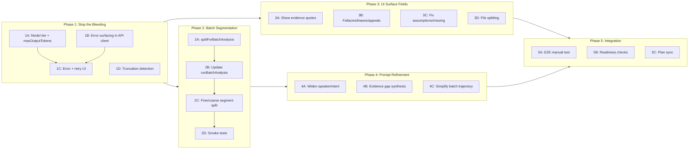

# Batch Analysis Pipeline Rearchitecture

## Context

When a user pastes an article (~500 lines), `splitIntoChunks` produces ~226 micro-segments. The analysis prompt demands one `trustTrajectory` value per segment. GPT-5.4-nano (a classification/extraction model) cannot reliably produce 226 trajectory values alongside a full rhetorical analysis, and `maxOutputTokens` is never set -- risking silent truncation. When the API returns 502, `fetchAnalysis` swallows the error and the UI shows the empty hero state with no feedback.

The original scratchpad approach (whole article + analytical prompt, GPT-4o) produced analyst-quality briefs. The current pipeline fragments that quality across micro-segments and an underpowered model.

**Key files in scope:**

- [src/lib/generate-object.ts](src/lib/generate-object.ts) -- model config, no `maxOutputTokens`
- [src/lib/segment-utils.ts](src/lib/segment-utils.ts) -- `splitIntoChunks` micro-segmentation
- [src/lib/analysis-core.ts](src/lib/analysis-core.ts) -- prompt builder, trajectory handling
- [src/lib/prompts.ts](src/lib/prompts.ts) -- `ANALYSIS_SYSTEM_PROMPT`, `speakerIntent` template
- [src/lib/schemas.ts](src/lib/schemas.ts) -- `rhetoricalCoreSchema`, `analysisModelSchema`
- [src/lib/api-client.ts](src/lib/api-client.ts) -- `fetchAnalysis` swallows errors
- [src/hooks/truth-session-runtime.ts](src/hooks/truth-session-runtime.ts) -- `runBatchAnalysis`, no error state
- [src/app/components/TruthPanel.tsx](src/app/components/TruthPanel.tsx) -- empty-state fallback, no error UI
- [src/app/components/TruthPanelSections.tsx](src/app/components/TruthPanelSections.tsx) -- missing fields, truncated chips
- [src/app/api/analyze/route.ts](src/app/api/analyze/route.ts) -- API route, `maxDuration`

---

## Phase 1: Stop the Bleeding (Error Handling + Model Fix)

**Goal:** Make batch analysis actually work and tell the user when it doesn't. Can be completed independently; unblocks manual testing of all subsequent phases.

### 1A. Add `maxOutputTokens` and model tier routing

In [src/lib/generate-object.ts](src/lib/generate-object.ts):

- Add a `"mini"` model entry: `gateway("openai/gpt-5.4-mini")` -- this is the right tier for structured analytical output (OpenAI positions nano for classification/extraction, mini for complex subtasks).
- Add `maxOutputTokens` parameter to `generateTypedObject`, default `16_384`.
- Pass it through to `generateText`.

```typescript
export type ModelId = "default" | "mini" | "gemini";

const models = {
  default: gateway("openai/gpt-5.4-nano"),
  mini: gateway("openai/gpt-5.4-mini"),
  gemini: gateway("google/gemini-3-flash"),
};
```

In [src/app/api/analyze/route.ts](src/app/api/analyze/route.ts):

- Use `modelId: "mini"` and `maxOutputTokens: 16_384` for the analysis call.

### 1B. Surface analysis errors to the user

In [src/lib/api-client.ts](src/lib/api-client.ts) -- `fetchAnalysis`:

- On non-OK responses, read the error body using the existing `readApiError` helper (already used by `fetchVerification` but not by `fetchAnalysis`).
- Return a discriminated result type like verification does, not bare `null`.

In [src/hooks/truth-session-runtime.ts](src/hooks/truth-session-runtime.ts):

- Add `setAnalysisError` to `runBatchAnalysis` args (mirroring `setVerificationError` pattern).
- On failure, call `setAnalysisError(message)` with the server's error string.

In [src/hooks/useTruthSession.ts](src/hooks/useTruthSession.ts):

- Add `analysisError` state (same shape as `verificationError`).
- Pass `setAnalysisError` into `runBatchAnalysis`.
- Clear it on `resetState` and on successful analysis.

### 1C. Add error + retry UI in TruthPanel

In [src/app/components/TruthPanel.tsx](src/app/components/TruthPanel.tsx):

- Add `analysisError` and `onRetryAnalysis` to `TruthPanelProps`.
- In the empty-state guard (line 211), check `analysisError` first -- if set, show the error message + a Retry button (same pattern as `VerdictsContent` error state at line 156-161 of [TruthPanelSections.tsx](src/app/components/TruthPanelSections.tsx)).
- In `DisclosureBody` for the `"analysis"` case, when `pipelineStatus.analysis === "error"` and no snapshot, show the error + retry instead of "Appears after more content."

### 1D. Distinguish truncation from parse errors in retry logic

In [src/lib/generate-object.ts](src/lib/generate-object.ts):

- Import `NoObjectGeneratedError` from `"ai"`.
- In the catch block, check `finishReason === 'length'` -- if so, skip retry (retrying truncation with the same params is futile) and throw immediately with a clear message.

---

## Phase 2: Fix Batch Segmentation (Backend)

**Goal:** Send the full article as a single segment for batch mode instead of 226 micro-chunks. The streaming/voice path stays untouched. Can be done in parallel with Phase 3 (UI), but must complete before Phase 4 (prompt refinement).

### 2A. Add batch-specific segmentation in `segment-utils.ts`

In [src/lib/segment-utils.ts](src/lib/segment-utils.ts):

- Keep `splitIntoChunks` as-is (used by streaming path).
- Add `splitForBatchAnalysis(text: string): string[]` that returns the whole text as a **single segment** (or at most 2-3 segments if the text exceeds ~60K chars, which would be rare).
- This aligns with the research consensus: for documents that fit in context (<5% of the 400K window), send the whole thing.

```typescript
const BATCH_SEGMENT_CHAR_LIMIT = 60_000;

export function splitForBatchAnalysis(text: string): string[] {
  if (text.length <= BATCH_SEGMENT_CHAR_LIMIT) return [text];
  // For very long documents, split on double-newlines into ~2-3 large sections
  // (preserves paragraph boundaries while staying under limit)
}
```

### 2B. Update `runBatchAnalysis` to use batch segmentation

In [src/hooks/truth-session-runtime.ts](src/hooks/truth-session-runtime.ts) line 133:

- Replace `splitIntoChunks(text)` with `splitForBatchAnalysis(text)` for the batch path.
- This reduces segments from ~226 to 1 (or 2-3 for very long documents).
- The trajectory will now be 1-3 values instead of 226 -- the trust chart will show a document-level score rather than a noisy per-paragraph zigzag.

### 2C. Keep fine-grained paragraph IDs for citation

The fine-grained `splitIntoChunks` output is still useful for:

- Topic segmentation (already a separate call)
- Verification claim-to-paragraph mapping
- Future "show me where" highlighting

In [src/hooks/truth-session-runtime.ts](src/hooks/truth-session-runtime.ts):

- Still compute and store fine-grained segments in `mem.current.segments` for downstream use by verification and topic segmentation.
- Pass the coarse batch segments to `fetchAnalysis` only.

```typescript
// Fine segments for citation/verification/topics
mem.current.segments = splitIntoChunks(text).map(...);
// Coarse segments for analysis
const analysisSegments = splitForBatchAnalysis(text).map(...);
const result = await fetchAnalysis("batch", analysisSegments);
```

### 2D. Update smoke tests and mocks

In [src/lib/readiness-smoke-checks.ts](src/lib/readiness-smoke-checks.ts):

- The batch test sends 1 segment -- this already works.
- Add a test with a longer text (multiple paragraphs) to verify batch analysis with the new segmentation.

In [src/lib/readiness-smoke-mocks.ts](src/lib/readiness-smoke-mocks.ts):

- No changes needed -- the mock already derives trajectory length from the prompt's segment count.

---

## Phase 3: Surface Hidden Analysis Fields (UI)

**Goal:** Render the five computed-but-hidden fields. Purely frontend; can be done in parallel with Phase 2. No backend changes.

Currently rendered in `AnalysisContent` (line 82-121 of [TruthPanelSections.tsx](src/app/components/TruthPanelSections.tsx)):

- tldr, speakerIntent, corePoints, evidenceTable (partial -- quote missing), appeals, steelman, missing (truncated), assumptions (truncated)

**Not rendered anywhere:**

- `emotionalAppeals` -- array of `{ type, quote, technique }`
- `namedFallacies` -- array of `{ name, quote, impact }`
- `cognitiveBiases` -- array of `{ name, quote, influence }`
- `flagRevisions` -- array of revision objects
- `evidenceTable[].quote` -- the exact source text backing each claim

### 3A. Show `evidenceTable[].quote`

In `AnalysisContent` ([TruthPanelSections.tsx](src/app/components/TruthPanelSections.tsx) line 104-109):

- Add the `quote` field below each evidence row, styled as an italic blockquote (like `TruthPanelExtras` already does for query evidence at line 87).

```tsx
<p className="text-[10px] italic text-[#888]">&ldquo;{r.quote}&rdquo;</p>
```

### 3B. Add `emotionalAppeals`, `namedFallacies`, `cognitiveBiases` sections

In `AnalysisContent` ([TruthPanelSections.tsx](src/app/components/TruthPanelSections.tsx)):

- Add three new sections between `AppealsToggle` and the Steelman box.
- Each follows the same pattern: `Lbl` header, then a list of `border-l-2` items with the quote and description.
- Use the existing color language: `#ff4400` for fallacies (pay attention), `#ffaa00` for biases (worth a closer look), `#ffaa00` for emotional appeals.
- These sections only render when the array is non-empty (no empty-state noise).

### 3C. Fix `assumptions` and `missing` to show full text

In `GapsAndAssumptions` ([TruthPanelSections.tsx](src/app/components/TruthPanelSections.tsx) line 43-79):

- Replace the 50/60-char truncated uppercase chips with readable list items.
- Use numbered `<li>` elements with `text-[11px] leading-snug` (same style as `corePoints`).
- Remove the `truncate` class and the `.slice()` truncation.
- Keep the colored left-border accent for visual distinction.

### 3D. Consider file splitting if `TruthPanelSections.tsx` exceeds 300 lines

Per the code standards rule (max 300 lines per file), the new sections may push this file over the limit. If so, extract `AnalysisContent` into its own file `AnalysisContent.tsx` and re-export from `TruthPanelSections.tsx`.

---

## Phase 4: Prompt and Schema Refinement

**Goal:** Align the analysis prompt with the original scratchpad quality. Depends on Phase 2 (batch sends whole text, not micro-segments). Can start after Phase 2 is code-complete.

### 4A. Widen `speakerIntent` prompt

In [src/lib/prompts.ts](src/lib/prompts.ts) line 35-36:

- Change from the narrow "I want you to feel X so you'll do Y" template to the original's richer framing.

Current:

```
SPEAKER INTENT (speakerIntent): State the unstated persuasive goal: "I want you to feel [emotion] so you'll [action]."
```

Proposed:

```
SPEAKER INTENT (speakerIntent): Restate the argument as the speaker's underlying personal motivation -- what they would say in private. Expose self-interest, identity positioning, or the subjective core beneath the rhetoric. Not a generic template -- a specific, revealing restatement.
```

Update the `.describe()` on the schema field in [src/lib/schemas.ts](src/lib/schemas.ts) line 79-81 to match.

### 4B. Add evidence gap synthesis to the prompt

In [src/lib/prompts.ts](src/lib/prompts.ts):

- Add guidance after the evidence table instruction:

```
After the evidence table, note cross-cutting evidence gaps -- patterns of missing data, anonymous sourcing, unfalsifiable claims, or methodology gaps that weaken the overall argument.
```

This maps to the original's "Notable gaps" synthesis that appeared after the evidence table.

### 4C. Simplify `trustTrajectory` for batch mode

In [src/lib/analysis-core.ts](src/lib/analysis-core.ts) `buildAnalysisPrompt`:

- For batch mode with 1-3 segments, the trajectory is essentially the document's overall trust score. The prompt should reflect this:

```
For batch mode: the trustTrajectory should contain a single overall trust score for the document (0.0-1.0).
```

### 4D. Add `evidenceGaps` field to schema (optional enhancement)

If the evidence gap synthesis doesn't fit cleanly into existing fields, consider adding:

```typescript
evidenceGaps: z.string().describe(
  "Cross-cutting synthesis of evidence gaps, anonymous sourcing patterns, and methodological weaknesses",
);
```

This would be a new field on `rhetoricalCoreSchema` in [src/lib/schemas.ts](src/lib/schemas.ts) and `AnalysisSnapshot` in [src/lib/types.ts](src/lib/types.ts). Only add if the existing `missing` array and `overallAssessment` don't adequately capture the synthesis.

---

## Phase 5: Integration Testing and Plan Sync

**Goal:** Verify the full pipeline works end-to-end, update the plan document, and run readiness checks. Sequential -- must follow all other phases.

### 5A. Manual end-to-end test

- Paste `article.txt` in the UI and verify:
  - Analysis completes without error
  - All sections render (evidence with quotes, fallacies, biases, emotional appeals, full assumptions, full missing)
  - Trust chart shows a meaningful score
  - Verification and topic segmentation still trigger
  - Error case: disconnect network, paste text, verify error message + retry button appear

### 5B. Run readiness checks

```bash
bun run smoke:readiness
bunx tsc --noEmit
bun run lint
```

### 5C. Update the plan document

Per the phase-hygiene rule: update [.cursor/plans/design_system_overhaul_6c0c9d4c.plan.md](.cursor/plans/design_system_overhaul_6c0c9d4c.plan.md) (or the relevant active plan) to reflect the batch analysis changes -- file paths touched, contracts changed, design decisions.

---

## Parallelization Map



- **Phase 1** is the prerequisite for everything (makes batch work at all)
- **Phase 2** and **Phase 3** can run in parallel after Phase 1
- **Phase 4** depends on Phase 2 (prompt changes assume whole-text batch segments)
- **Phase 5** is the sequential tail after all other phases

## Files Changed Per Phase

- **Phase 1:** `generate-object.ts`, `api-client.ts`, `truth-session-runtime.ts`, `useTruthSession.ts`, `TruthPanel.tsx`, `analyze/route.ts`
- **Phase 2:** `segment-utils.ts`, `truth-session-runtime.ts`, `readiness-smoke-checks.ts`
- **Phase 3:** `TruthPanelSections.tsx` (possibly split into `AnalysisContent.tsx`)
- **Phase 4:** `prompts.ts`, `schemas.ts`, `types.ts`, `analysis-core.ts`
- **Phase 5:** Plan document, no code changes
