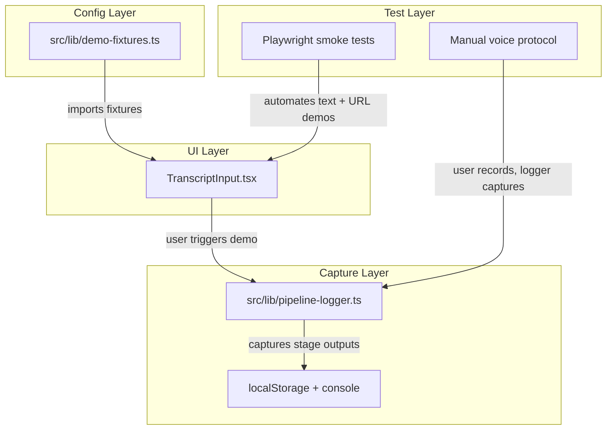

# Demo Testing Harness

## Current State

- Three demo transcripts are hardcoded as string constants in [`src/app/components/TranscriptInput.tsx`](src/app/components/TranscriptInput.tsx) (lines 6-60), bloating it to 346 lines
- Demos only cover one input mode: paste text
- No pipeline logging exists -- errors are silently swallowed in `api-client.ts` and hooks
- No test framework is installed (no vitest, jest, or playwright)
- The only test infrastructure is `readiness-smoke-checks.ts` which mocks the LLM and runs pipeline functions in-process

## Architecture



## 1. Demo Fixtures Config

Create [`src/lib/demo-fixtures.ts`](src/lib/demo-fixtures.ts) -- a structured config defining each demo scenario:

```typescript
export type DemoInputMode = "text" | "url" | "voice-prompt";

export interface DemoFixture {
  key: string;
  label: string;
  inputMode: DemoInputMode;
  content: string; // text body, URL, or voice instructions
  description: string; // what this demo exercises
  expectedTraits: string[]; // e.g. ["stat flags", "emotional appeals", "verification"]
}

export const DEMO_FIXTURES: DemoFixture[] = [
  { key: "tech-pitch", label: "Tech pitch", inputMode: "text", content: "...", ... },
  { key: "andreessen", label: "Andreessen", inputMode: "text", content: "...", ... },
  { key: "lenny-pod", label: "Lenny Pod", inputMode: "text", content: "...", ... },
  { key: "youtube-clip", label: "YouTube clip", inputMode: "url", content: "https://www.youtube.com/watch?v=...", ... },
  { key: "voice-test", label: "Voice test", inputMode: "voice-prompt", content: "Read the following aloud: ...", ... },
];
```

`TranscriptInput.tsx` imports `DEMO_FIXTURES` instead of defining its own constants. The dropdown groups by `inputMode` -- text demos populate the textarea, URL demos auto-trigger `onFetchUrl`, voice demos show instructions. `DemoKey` and `InputMode` types move to `src/lib/types.ts`.

## 2. Pipeline Logger

Create [`src/lib/pipeline-logger.ts`](src/lib/pipeline-logger.ts) -- a lightweight capture layer that records pipeline stage inputs/outputs:

```typescript
export interface PipelineEvent {
  sessionId: string;
  stage: "pulse" | "analysis" | "verification" | "summary" | "topics" | "extract";
  status: "start" | "success" | "error";
  timestamp: number;
  durationMs?: number;
  input?: unknown; // segment count, mode, etc (not full text to keep size sane)
  output?: unknown; // summary stats: flag count, claim count, verdict counts
  error?: string;
}

export interface SessionTrace {
  sessionId: string;
  inputMode: string;
  fixtureKey?: string; // links back to demo config if run from a demo
  events: PipelineEvent[];
  startedAt: number;
}
```

The logger is a thin singleton that `useTruthSession` feeds events into. It captures:

- Stage start/complete/error with timing
- Input metadata (segment count, mode, window size -- not raw text)
- Output summaries (flag count, claim count, verdict distribution, trajectory length)
- Errors with messages

Storage: events are held in memory during a session, then written to `localStorage` under `truthlens-traces` on session end. A `console.groupCollapsed` summary is also printed so you can see results in devtools during manual testing. A `downloadTrace(sessionId)` helper exports a trace as a JSON file for fixture archival.

## 3. Wire Logger into useTruthSession

Add logging calls at each pipeline stage in [`src/hooks/useTruthSession.ts`](src/hooks/useTruthSession.ts):

- `fetchPulse` -> log pulse start/result/error
- `fetchAnalysis` -> log analysis start/result/error with mode and segment count
- `fetchVerification` -> log verification start/result/error with claim stats
- `fetchTopicSegments` -> log topic start/result/error
- `fetchUrlExtract` -> log extract start/result/error with URL

The logger is opt-in via a ref so it adds zero overhead when not capturing. Each event includes `durationMs` computed from start/end timestamps.

## 4. Update TranscriptInput.tsx

- Remove the three `DEMO_*` string constants and the `DEMOS` record (lines 6-60, saving ~55 lines)
- Import `DEMO_FIXTURES` from `src/lib/demo-fixtures.ts`
- Move `DemoKey` type to `src/lib/types.ts` (or replace with `string` keyed by fixture `key`)
- The demo dropdown renders from `DEMO_FIXTURES`, grouped by input mode
- Loading a URL fixture calls `onFetchUrl` directly instead of setting textarea text
- Loading a voice fixture shows the prompt text as instructions
- This brings the file well under 300 lines

## 5. Playwright Smoke Tests

Install Playwright and create a minimal smoke test suite that exercises the automatable demos:

- **Text demo**: load page -> open demo dropdown -> click "Tech pitch" -> verify "Analyze" button activates -> click it -> wait for analysis results to appear in TruthPanel
- **URL demo**: load page -> open demo dropdown -> click "YouTube clip" -> verify fetch starts -> wait for analysis results
- **Voice demo**: skip automation (mic requires real hardware) -- instead, output a manual test protocol

Test file: `tests/demo-smoke.spec.ts`

Config: `playwright.config.ts` pointing at `localhost:3000`, with a `webServer` config to start the dev server.

The tests do NOT assert on LLM output content (that's nondeterministic). They assert on structural outcomes: TruthPanel renders, flag count appears, chart renders, no unhandled errors in console.

## 6. Manual Voice Test Protocol

Since voice input requires real mic hardware, create a documented protocol (printed to console when voice demo is selected):

1. Click "Voice test" from demo dropdown -- instructions appear
2. Click mic button, read the provided script aloud
3. Stop recording after the script
4. Pipeline logger captures the full session trace
5. User can export the trace via `downloadTrace()` in devtools

This captured trace becomes a fixture for future regression testing of the analysis pipeline (inputs are frozen, only LLM outputs vary).

## File Changes Summary

- **New**: `src/lib/demo-fixtures.ts` (fixture config, ~80 lines)
- **New**: `src/lib/pipeline-logger.ts` (capture layer, ~90 lines)
- **New**: `tests/demo-smoke.spec.ts` (Playwright smoke tests, ~80 lines)
- **New**: `playwright.config.ts` (minimal config)
- **Modified**: `src/app/components/TranscriptInput.tsx` (remove inline demos, import fixtures, shrink to ~290 lines)
- **Modified**: `src/hooks/useTruthSession.ts` (add logger calls at pipeline stages)
- **Modified**: `src/lib/types.ts` (add `DemoInputMode`, `DemoFixture` types)
- **Modified**: `package.json` (add `@playwright/test` dev dependency, add `test:smoke` script)
