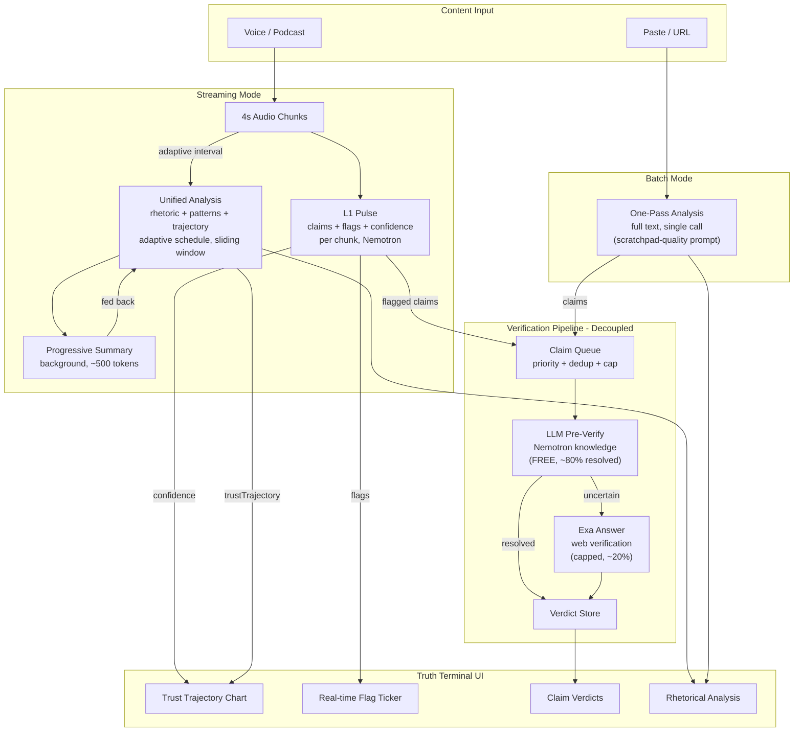
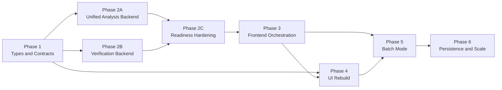

# Pipeline Rearchitecture v2: One-Pass + Truth Terminal

## The Soul of TruthLens

Every line of code, every pixel, every prompt, every label in this product flows from one belief:

**Clarity is a human right.**

When someone speaks to persuade you, you deserve to see the structure of their persuasion -- the claims, the evidence, the techniques, the gaps -- so you can think for yourself. TruthLens does not tell you what to think. It shows you how someone is trying to make you think something. You decide the rest.

There is a kid sitting in a high school debate round, watching the opposing team use emotional manipulation instead of evidence. They know something is wrong. They can feel it. But they don't have the word for it, and by the time they figure it out, the conversation has moved on. That kid grew up. The debates got bigger -- podcasts, politics, pitches, panels. The techniques got more sophisticated. But the feeling stayed the same: _something's off, and I can't say exactly what._

TruthLens exists for that moment. The moment your gut knows before your mind catches up.

### The Tool as Amplifier, Not Authority

TruthLens is an extension of the user's own perception, not a separate intelligence passing judgment. When the trust line drops, the user should not think "the AI detected something." They should think "I noticed something." The tool validates and names. It does not discover and accuse.

This is the difference between a product people use and a product people love. A fact-checker says TRUE or FALSE. TruthLens says: here is the claim, here is what supports it, here is the technique being used, here is what's missing. Now you decide.

This is what a great teacher does. They don't give you the answer. They show you how to think about the question.

### Five Principles

**1. Name the unnamed.** The most powerful thing TruthLens does is give you the word for what you felt. "That was a straw man." "That statistic has no source." "That's false consensus." Your gut knew. Now your mind knows too. This is the moment of clarity the entire product exists to create.

**2. Silence is information.** When the screen is calm -- no flags, the line holding steady -- that calm IS the signal. It means "this person is being straight with you." The absence of alerts communicates as powerfully as their presence. A quiet screen during a rigorous passage is not a failure of the tool. It is the tool working perfectly.

**3. The speaker deserves fairness.** Every argument gets a steelman -- its strongest possible interpretation. This is not optional. It is not a nice-to-have feature. It is the thing that separates TruthLens from a gotcha toy and makes it a tool for genuine understanding. Intellectual honesty demands that we separate "I disagree with this" from "this is poorly argued."

**4. Truth is a trajectory, not a verdict.** The trust chart is a line, not a switch. Arguments have arcs. People are sometimes rigorous and sometimes sloppy, sometimes honest and sometimes careless. A speaker who starts strong and slips is fundamentally different from one who was never trying. The line captures that. A binary label never could.

**5. Respect every glance.** The user's attention is sacred. Every element on the screen must earn its presence. If it doesn't serve the moment of clarity -- the instant someone looks down and gets the answer they need -- it does not belong. One wasted glance and the user stops trusting the tool. One hundred useful glances and they can't live without it.

### How the Soul Manifests

**In prompts:** The LLM is instructed to be analytical, not adversarial. It identifies techniques, not villains. It uses precise language: "unsupported" not "false," "assertion only" not "no evidence," "unnamed attribution" not "made up source." The steelman is always generated. The analysis treats every argument as a sincere attempt at reasoning, even inflammatory ones.

**In labels and copy:** Flags describe what happened, not what the speaker is. "STAT -- no source cited" not "LIAR -- made up a number." Loading states are calm: "Analyzing..." not "Hunting for lies." Empty states invite: "Paste. Speak. See through the rhetoric." Results never condescend. The user is smart. Treat them that way.

**In color and motion:** Red means "pay attention here," not "bad person." Green means "this checks out," not "good person." Amber means "worth a closer look." Animations fire only on state changes -- never decorative, never performative. The UI is mostly still. When it moves, it means something. This is how trust is built: the tool never cries wolf.

**In the experience:** When a user turns TruthLens on themselves -- "am I doing this too?" -- the tool should feel empowering, not shaming. When the trust line holds steady for a speaker the user expected to flag, they should feel pleasantly surprised, not disappointed. The tool makes you a better listener, not a more suspicious one.

**In architecture:** Every technical decision serves the moment of clarity. Adaptive scheduling exists so the tool can sustain a 2-hour podcast without burning out. Sliding windows exist so context stays sharp without drowning in tokens. The verification pipeline exists so "unsupported" can become "supported" or "refuted" with evidence. None of this is infrastructure for its own sake. It all serves one purpose: being ready when the user glances down.

---

## Canonical Domain Model (from Truth Terminal Architecture)

All types, schemas, routes, and UI selectors share one flat domain model. No optional-vs-required drift. No duplicate shapes. One source of truth.

- **`TruthSession`** -- session id, `mode` (`streaming` | `batch`), `inputKind` (`voice` | `paste` | `url`), lifecycle timestamps, optional source metadata. The top-level container.
- **`SourceAsset`** -- URL extraction metadata: title, excerpt, original URL. Preserved from `/api/extract` so future persistence, sharing, and clips don't require a data-model rewrite.
- **`TranscriptSegment`** -- stable `segmentId`, text, ordinal index, optional `startMs`/`endMs`. This replaces loose chunk strings. The shared unit for voice, paste, and URL.
- **`SegmentPulse`** -- L1 output for a segment: `claims`, `flags`, `tone`, `confidence`. Keyed to `segmentId`.
- **`AnalysisSnapshot`** -- unified analysis result for a specific window or full pass. Includes rhetorical analysis, patterns, trust trajectory, AND provenance about what window/horizon produced it.
- **`SessionSummary`** -- rolling summary used as analysis context only. Never the user-facing source of truth.
- **`ClaimCandidate`** -- normalized claim text tied to one or more segment ids, dedupe key. `priority` and `verifiable` are set by LLM triage (NOT regex heuristics). Optional `triageReason` and `triageConfidence` preserve the model's classification rationale.
- **`ClaimTriageResult`** -- LLM triage output per claim: `claimId`, `verifiable`, `priority` (0-5), `confidence`, `reason`. Merged into `ClaimCandidate` by `claimId`.
- **`ClaimVerdict`** -- final verification state: verdict, source, confidence (from model, not proxies), explanation, citations.
- **`VerificationRun`** -- queue metadata, per-session caps, status, counts. Distinguishes `queued` | `model-assessed` | `web-verified` | `skipped` | `cap-exceeded`.
- **`TruthPanelView`** -- derived view model ONLY. Computed from the above via selectors. Never stored as source-of-truth state.

### State Ownership (prototype defaults)

- Source-of-truth session state stays **client-side**. Extract a `useTruthSession` reducer/hook from `page.tsx` instead of adding Zustand/Redux.
- Pipeline scheduling lives in `src/lib/pipeline-policy.ts` (the adaptive scheduler), imported by the hook.
- Do not add backend persistence yet. If refresh survival is needed, persist a lightweight session envelope in `localStorage` after contracts are stable.
- All model responses are **schema-validated JSON** via Zod `generateObject`. No freeform markdown in the pipeline.

### Orchestration Extraction

`page.tsx` is currently a 545-line hidden state machine. Extract a `useTruthSession` hook that owns:

- Session init and resets
- Segment append/flush (voice and paste)
- Request IDs and stale-response protection (ignore responses from superseded analysis calls)
- Pipeline status per stage (`idle` | `running` | `success` | `error`)
- Batch vs streaming policy differences
- Derived selectors that feed TruthPanel

New files: `src/hooks/useTruthSession.ts`, `src/lib/pipeline-policy.ts`

`page.tsx` becomes a thin composition shell: render TranscriptInput + TruthPanel, wire up the hook, done.

---

## Code Hygiene (from ESLint research)

Enforced via ESLint so agents respect these constraints during implementation:

- **`max-lines: 300`** (skip blanks, skip comments) -- the community and AI-optimized sweet spot. Override for schemas/configs/generated files.
- **`max-lines-per-function: 50`** -- companion rule, keeps functions focused.
- **File structure:** if a folder exceeds ~12-15 files, create sub-folders. No standard ESLint rule exists; enforce via review.
- **All new types in `types.ts`, all new schemas in `schemas.ts`, all new prompts in `prompts.ts`** -- no scattering contracts across route files.

---

## What Changed From v1

The original plan had the right cost-optimization ideas (adaptive scheduling, sliding window, LLM pre-verify, Exa). This v2 keeps all of those but adds three insights from the scratchpad and user feedback:

1. **Merge L2+L3** -- the scratchpad's `route.ts` proves a single well-prompted LLM call produces analysis quality matching or exceeding our multi-pass system. Currently L3's `patternsSchema` already includes `fullAnalysis` which duplicates L2's entire output structure. Eliminating this redundancy cuts analysis API calls in half.
2. **One-pass batch mode** -- for paste/URL, skip chunked L1 entirely. One comprehensive analysis call (like the scratchpad GPT-4o route) + one verification pass. Simpler, faster, cheaper.
3. **UX-first design** -- user feedback makes clear: the real-time streaming experience IS the product. "Truth Terminal." Backend optimization is important but secondary to what users see and feel.

---

## User Feedback --> Product Requirements

From Sterling's feedback, distilled into requirements:

| User Quote                                                          | Requirement                                                                                                   |
| ------------------------------------------------------------------- | ------------------------------------------------------------------------------------------------------------- |
| "the 'truth' meter declining over 5 minutes"                        | **Trust trajectory chart updating in real-time** (currently L3 only, needs to update more frequently)         |
| "catching weird logical jumps in argumentation"                     | **L1 flags surfaced prominently** -- logic, contradiction, attribution flags are the core UX                  |
| "like a truth terminal for rhetoric"                                | **Dense, professional, information-forward layout** -- not a chatbot, a monitoring dashboard                  |
| "it's an experience, just like you can't get a summary of an album" | **The streaming animation matters** -- progressive reveal, live updating, visual feedback                     |
| "a whole podcast analyzed with a click"                             | **Batch mode** -- URL in, full analysis out, no streaming required                                            |
| "clips of 90 seconds with analysis on bottom"                       | Future: clip extraction. For now, ensure analysis data is segmented and addressable by time range             |
| "catching someone using rhetorical tricks - feels good vibe"        | **Verdicts and flags need emotional satisfaction** -- clear verdicts, color-coded, satisfying to see "caught" |

**Priority order:** real-time experience > flag/verdict display > trust trajectory > batch mode > cost optimization

---

## Architecture



**Key difference from v1:** L2 and L3 are merged into a single "Unified Analysis" endpoint. Paste/URL gets its own "One-Pass" path that skips L1 chunking entirely.

---

## Design Decision 1: Merge L2 + L3

**Why:** The current system makes two separate API calls that produce overlapping data:

- L2 (`deep/route.ts`): TLDR, corePoints, evidenceTable, appeals, assumptions, steelman, missing
- L3 (`patterns/route.ts`): patterns, trustTrajectory, overallAssessment, **fullAnalysis** (identical to L2 output)

L3 literally includes `fullAnalysis?: AnalysisResult` -- the entire L2 output nested inside L3. The scratchpad's one-pass analysis and rhetorical analyzer skill both prove a single prompt handles all of this.

**New unified endpoint:** `POST /api/analyze/route.ts` -- DONE

```typescript
// Input (AnalysisRequest)
{ segments: TranscriptSegment[], runningSummary?: SessionSummary, priorPulses?: SegmentPulse[], mode: "streaming" | "full" | "batch" }

// Output: AnalysisSnapshot (merged L2 + L3 + enriched fields)
{
  tldr, corePoints, speakerIntent, evidenceTable, appeals,
  emotionalAppeals, namedFallacies, cognitiveBiases,
  assumptions, steelman, missing,
  patterns, trustTrajectory, overallAssessment, flagRevisions,
  mode, windowStart?, windowEnd?, segmentIds, timestamp,
}
```

**Prompt:** Single `ANALYSIS_SYSTEM_PROMPT` in [prompts.ts](src/lib/prompts.ts), drawing from the scratchpad's rhetorical analyzer skill structure plus pattern detection and trust trajectory. Uses `generateObject()` with `analysisSnapshotSchema`.

**Impact:** 2-hour podcast goes from ~156 analysis calls (78 L2 + 78 L3) to ~78 unified calls. Same information, half the API calls.

---

## Design Decision 2: Three Analysis Horizons

The transcript is a growing asset. Real-time analysis is one lens on it. The system should support three temporal horizons, each serving a different need.

### Horizon 1: Real-Time (Sliding Window)

What's happening RIGHT NOW. The peripheral monitor. Updates every ~4 seconds.

1. **L1 Pulse** -- every chunk (~4s), fast. Extracts claims, flags, tone, confidence. Feeds the live flag ticker and trust chart.
2. **Unified Analysis** -- adaptive schedule. Sliding window: last 20 chunks + running summary (~2,500 tokens constant). Produces rhetorical breakdown + patterns for the recent window.
3. **Progressive Summary** -- background updates running summary as chunks accumulate. Tracks developing threads, not just compressing.

This is the "in the conversation" experience. Fast, lightweight, keeps up.

### Horizon 2: Full-Transcript Passes (Key Moments)

The WHOLE transcript -- minute 1 + minute 2 + ... + minute N -- analyzed as a single unit. This is where the comprehensive rhetorical analysis gets its richest data because it can see the full arc, not just the recent window.

**When it fires (adaptive cadence, dense early, expanding later):**

- **45 seconds** (~11 chunks) -- first full pass. Even a TikTok-length clip gets the comprehensive treatment.
- **3 minutes** (~45 chunks) -- second pass. Short clips and YouTube videos are fully analyzed.
- **5 minutes** (~75 chunks) -- third pass. Sterling's "truth meter declining over 5 minutes" moment. The arc is now visible.
- **10 minutes** (~150 chunks) -- fourth pass. Cross-topic patterns and gradual escalation emerge.
- **Every 5 minutes after that** -- steady cadence for long sessions. A 2-hour podcast gets ~22 full passes total.
- At **stop** (recording ends) -- final definitive pass.
- **On demand** (user taps "Full Analysis").

**What it does differently from the sliding window pass:**

- Sees the complete argument arc -- setup, development, climax, conclusion
- Detects patterns that only emerge over time (gradual escalation across 30 minutes, a contradiction between minute 5 and minute 40)
- Produces the definitive TLDR, evidence table, and steelman (not a partial view)
- Generates the final trust trajectory with full context

**Cost:** A full-transcript pass on a 2-hour podcast (~180k tokens) is expensive. Mitigation: use the progressive summary as input rather than raw transcript for sessions longer than ~30 minutes. The summary at that point is high-quality because it's been refined across many updates. For sessions under 30 minutes, send the full raw transcript.

**The unified analysis endpoint handles both:** `mode: "streaming"` uses sliding window. `mode: "full"` uses full transcript or high-fidelity summary. `mode: "batch"` is for paste/URL (same as full, but no streaming preceded it).

### Horizon 3: Post-Analysis Queries (On-Demand, After Session)

After the real-time session, the transcript becomes queryable raw material. This is NOT real-time -- it happens when the user is reviewing, exploring, or preparing to share. No competition with the live conversation.

**Topic segmentation / chapters:**

- Detect where the conversation shifts topics. "Minutes 12-18: AI job displacement. Minutes 18-24: education system. Minutes 24-31: UBI proposal."
- These become natural chapter markers AND clip boundaries (maps directly to Sterling's 90-second clip use case).
- Implementation: a dedicated query to the LLM with the full transcript (or summary + chunk boundaries), asking for topic shifts with timestamps.

**Theme-based reorganization:**

- Regroup everything said about a specific topic across the entire session, regardless of chronological order. "Everything they said about AI, collected from minutes 3, 12-18, 27, and 45."
- Useful for research, debate prep, and creating topic-specific summaries.

**Targeted deep dives:**

- "What rhetorical techniques did they use specifically when talking about jobs?"
- "Show me every unsupported claim about economic data."
- "Compare how they talked about AI in the first 10 minutes vs the last 10 minutes."
- These are ad-hoc LLM queries against the stored transcript. The user asks, the LLM answers with evidence from the text.

**Cross-topic pattern detection:**

- "They used the same appeal-to-authority technique when discussing both AI and climate."
- "Their confidence increased when discussing their own expertise but decreased on policy specifics."
- These patterns only emerge when you look across topics, not within a single segment.

**Implementation -- topic segmentation via Gemini (from transcribe-groq):**

The topic segmentation approach is adapted from the proven timestamp generation system in [transcribe-groq](https://github.com/RayFernando1337/transcribe-groq/blob/main/convex/utils/timestamps.ts). That system uses:

- `google('gemini-2.5-pro')` via Vercel AI SDK `generateObject()` with Zod schema validation
- A 4-step prompt process: Initial Analysis -> Identify Key Moments -> Draft Descriptions -> Format & Review
- Content-density over fixed numbers (~1 key moment every 5-10 minutes, flexible)
- Coverage validation (ensures the full duration is analyzed)
- Gemini thinking mode (`thinkingBudget: -1`) for complex reasoning over long transcripts

For TruthLens, adapt as follows:

- **Model:** `google('gemini-2.5-pro')` for the topic segmentation pass (Nemotron stays for L1/unified analysis). Gemini handles long transcripts well and thinking mode helps with structural reasoning.
- **Input:** Full transcript (or high-fidelity progressive summary for sessions >30 min) + accumulated L1 flags with chunk indices
- **Output schema (Zod-validated):**

```typescript
interface TopicSegment {
  startTime: string; // MM:SS or HH:MM:SS
  endTime: string;
  topic: string; // 3-7 word noun phrase (YouTube chapter style)
  segmentType:
    | "argument-development"
    | "evidence-presentation"
    | "emotional-appeal"
    | "topic-shift"
    | "qa-exchange"
    | "philosophical-tangent"
    | "anecdote"
    | "summary-recap";
  flagsDuringSegment: string[]; // flag types that fired in this range
  claimCount: number;
  avgConfidence: number;
}
```

- **Prompt process (adapted from transcribe-groq v4.0):**
  1. Initial Analysis -- read the full transcript, identify the overall structure and flow
  2. Identify Topic Boundaries -- mark where the conversation shifts, where argument phases change, where evidence vs emotion vs anecdote patterns emerge
  3. Draft Segment Labels -- short noun phrases (not sentences), scannable as chapter titles
  4. Format & Review -- chronological order, check coverage, ensure segments span the full duration

- **Segment types (adapted from transcribe-groq's moment types):**
  - `argument-development` -- speaker building toward a claim (replaces "Feature Demonstration")
  - `evidence-presentation` -- data, studies, examples being cited (replaces "Pro-Tips")
  - `emotional-appeal` -- pathos-heavy segment, fear/outrage/inspiration framing (replaces "Aha! Moments")
  - `topic-shift` -- major subject change (same as transcribe-groq's "Major Topic Shifts")
  - `qa-exchange` -- host-guest back-and-forth (replaces "Community Moments")
  - `philosophical-tangent` -- broader worldview statement (same as "Soapbox Segments")
  - `anecdote` -- personal story used as evidence
  - `summary-recap` -- speaker restating or wrapping up

These segments become natural clip boundaries (Sterling's 90s vertical format), chapter markers for podcast navigation, and grouping keys for theme-based reorganization.

**Implementation:** A dedicated `/api/analyze/segments/route.ts` that accepts the full transcript + L1 flag data. Fires once at session stop or on demand. Uses Gemini, not Nemotron. Returns `TopicSegment[]`. For the prototype, this is Phase 5 scope -- not needed for the real-time experience but critical for the post-analysis and clip/share use cases.

### Batch Mode (Paste / URL)

For articles and pasted text -- enters directly at Horizon 2 (full-transcript analysis):

1. **Skip L1 chunking.** Send full text to the unified analysis endpoint with `mode: "batch"`.
2. **One call** produces the complete rhetorical analysis (TLDR through steelman, plus patterns and trust trajectory).
3. **Extract claims** from the analysis output (evidenceTable claims + any flagged items).
4. **Run verification** once on all extracted claims.
5. **Result:** Article analyzed in ~2 API calls (1 analysis + 1 verification batch).

For URLs, the existing `/api/extract/route.ts` handles article text extraction.

---

## Design Decision 3: Spoken Content Intelligence

### The Problem

Written text arrives pre-structured. Each paragraph is a complete thought. A 4-second chunk of polished prose is analyzable in isolation.

Podcast speech is nothing like that. Speakers build up points across 2-3 minutes. They repeat the same idea in different words for emphasis. They hedge naturally ("I think," "it seems like"). They meander before landing. Two speakers co-construct claims through question-and-response. The point often only becomes clear minutes after the build-up started.

If L1 treats each 4-second chunk as an independent unit, it will:

- Flag conversational hedging as "vague" (false positive)
- Flag a build-up chunk as incomplete when it's mid-thought (premature)
- Miss that 3 "separate claims" are actually the same point repeated for emphasis (redundant flags)
- Not understand that a question from the host + answer from the guest = one co-constructed claim

This violates the soul: "the tool never cries wolf." Premature flags erode trust in the tool itself.

### Solution: Three-Layer Context Awareness

**L1 adjustments for spoken content:**

- The L1 prompt must be calibrated for spoken register. Conversational hedging ("I think," "it seems like," "in my experience") is NOT vagueness -- it's natural speech. Only flag genuine epistemic vagueness where a concrete claim is made without specifics.
- L1 should receive the **previous 2-3 chunks** as context (not just the current chunk), so it can recognize mid-thought continuations. Cost: ~200 extra tokens per call, negligible.
- L1 confidence should be slightly higher by default for spoken content. The bar for flagging should be "genuinely problematic," not "imperfectly phrased."

**Progressive summary tracks developing threads:**

- The running summary maintained by `/api/analyze/summarize` should not just compress past content -- it should track **developing arguments** that aren't yet complete. Example: "Speaker is building toward a claim about AI job displacement. Setup phase, not yet landed."
- This lets the unified analysis understand where the speaker is in their argument arc, not just what they've said.

**Unified analysis retroactively re-evaluates L1 flags:**

- When the unified analysis runs (every 16s-4min), it has the full sliding window. It can recognize that a "vague" flag from chunk 3 was actually the setup for a well-supported argument at chunk 8.
- The analysis output should include a `flagRevisions` field: flags from earlier chunks that should be upgraded, downgraded, or dismissed in light of fuller context.
- The UI updates the flag feed when revisions arrive -- a flag that was amber might turn green, or a "vague" might be reclassified as "building toward: [claim]."

### Enriched Analysis Schema (from scratchpad review)

Comparing the three scratchpad analysis frameworks against our current prompts reveals gaps:

**What we should add to the unified analysis output (from scratchpad `route.ts` and rhetorical analyzer skill):**

- `emotionalAppeals`: Array of named emotions with quotes -- not just "pathos" as a single blob, but `[{type: "fear", quote: "...", technique: "..."}]`. The 1-pass analysis identified Fear and Resentment as distinct techniques. Our current `appeals.pathos` string loses this granularity.
- `namedFallacies`: Array of specific logical fallacy names with the triggering quote -- `[{name: "straw man", quote: "...", impact: "..."}]`. Our L1 "logic" flag doesn't name the fallacy. The 1-pass analysis said "Straw Man" with the exact text.
- `cognitiveBiases`: Array of identified biases -- `[{name: "optimism bias", quote: "...", influence: "..."}]`. We don't extract these at all. The 1-pass analysis found this.
- `speakerIntent`: The "What They Actually Want to Say" field from the rhetorical analyzer skill. Our current `underlyingStatement` is close but should be sharpened to match the skill's devastating one-liner format: _"I want you to feel X so you'll do Y."_
- `quotedEvidence`: Every evidence table row should include the actual quote from the source, not just a paraphrase. The Yang analysis pinned every claim to specific words.

**What L1 flags should capture (enhanced):**

Current flag types: `vague`, `stat`, `prediction`, `attribution`, `logic`, `contradiction`

Add:

- `emotional-appeal`: Named emotional technique being used (fear, guilt, outrage, flattery)
- `cognitive-bias`: Named bias detected (anchoring, false consensus, appeal to nature)
- `building`: Not a problem flag -- an informational marker that the speaker is developing an argument not yet complete (for spoken content only)

The `building` flag type is critical for podcasts. It tells the user "this isn't a red flag, this is a developing thought" and prevents premature alerts that erode trust in the tool.

---

## Design Decision 4: Verification Pipeline (kept from v1, refined)

The original plan's two-phase verification is sound. Keeping it with one refinement: verification is now a completely independent pipeline, never mixed into the analysis prompt.

### Pipeline

```
L1 flags claims (streaming) OR analysis extracts claims (batch)
  --> LLM Claim Triage (src/lib/verification-core.ts, CLAIM_TRIAGE_PROMPT)
      - Model classifies each claim as verifiable or not (opinions, predictions, advice -> skip)
      - Model assigns priority 0-5 based on semantic importance
      - NO regex heuristics for verifiability or priority -- the model decides
  --> Claim Queue (src/lib/claim-queue.ts)
      - Normalization + fuzzy dedup via alphanumeric key
      - Per-session cap: 10 Exa calls (configurable)
      - Queue only handles dedup and cap, NOT classification
  --> LLM Pre-Verify (POST /api/verify/pre-check)
      - Nemotron evaluates from training knowledge (FREE)
      - ~80% resolved as supported/refuted/not-verifiable
  --> Exa Answer (POST /api/verify/route.ts)
      - Only "uncertain" claims reach Exa (NOT "unverifiable" -- these are different)
      - Structured verdict via outputSchema, including model-assessed confidence
      - Confidence comes from the model's structured output, NOT citation counts
      - $5/1k requests, 1,000 free/month
  --> Verdicts rendered in UI
```

### Verification invariants (learned from implementation)

1. **No regex/heuristic classification.** Verifiability and priority are semantic judgments. The LLM triage step owns them via CLAIM_TRIAGE_PROMPT. claim-queue.ts only normalizes, dedupes, and caps.
2. **Claims flow by claimId, not string matching.** The LLM may echo claim text differently. All pipeline joins (triage merge, pre-verify to Exa routing) must use stable `claimId`, never exact string comparison on `claim.text`.
3. **`uncertain` != `unverifiable`.** `uncertain` means "I don't know, web search would help" -> routes to Exa. `unverifiable` means "this cannot be objectively fact-checked" -> skipped. Never collapse these.
4. **Confidence from the model, not proxies.** Exa outputSchema includes a confidence field. Pre-verify returns model confidence. Never fabricate confidence from citation counts, text length, or other proxy metrics.

### Types

```typescript
interface ClaimTriageResult {
  claimId: string;
  verifiable: boolean;
  priority: number; // 0-5, model-assigned
  confidence: number; // 0.0-1.0
  reason: string;
}

interface LLMPreVerdict {
  claimId: string;
  claim: string;
  verifiable: boolean;
  confidence: number;
  verdict: "supported" | "refuted" | "uncertain" | "not-verifiable";
  explanation: string;
  needsWebSearch: boolean;
}

interface ClaimVerdict {
  claimId: string;
  claim: string;
  verdict: "supported" | "refuted" | "unverifiable" | "partially-supported";
  confidence: number;
  explanation: string;
  source: "llm-knowledge" | "exa-web" | "unverified";
  citations?: Array<{ title: string; url: string; snippet: string }>;
}

interface VerificationRun {
  sessionId: string;
  status: "queued" | "model-assessed" | "web-verified" | "skipped" | "cap-exceeded";
  llmResolved: ClaimVerdict[];
  webVerified: ClaimVerdict[];
  unverified: Array<{
    claimId: string;
    claim: string;
    reason: "needs-web" | "not-verifiable" | "cap-exceeded";
  }>;
  stats: { totalClaims: number; llmChecked: number; webSearched: number; capped: number };
  timestamp: number;
}
```

---

## Design Decision 5: Adaptive Scheduling + Sliding Window (kept from v1)

Identical to v1 plan but now applied to ONE analysis endpoint instead of two separate L2/L3 endpoints. The math improves:

**Adaptive interval function** (same as v1):

```typescript
function getAnalysisInterval(chunkCount: number): number {
  if (chunkCount < 75) return 4; // first 5 min: every 16s
  if (chunkCount < 225) return 8; // 5-15 min: every 32s
  if (chunkCount < 450) return 16; // 15-30 min: every 64s
  if (chunkCount < 900) return 32; // 30-60 min: every ~2 min
  return 64; // 60+ min: every ~4 min
}
```

**Sliding window** (same as v1, now for unified analysis):

- Last 20 chunks (~2,000 tokens) + running summary (~500 tokens) = ~2,500 tokens constant per call
- Progressive summarization runs in background via `POST /api/analyze/summarize`

**2-hour podcast cost (v2 vs v1 vs current):**

- **Current:** 449 L2 + 449 L3 = 898 calls, ~160M tokens, 1,347 Tavily searches
- **v1 plan:** 78 L2 + 78 L3 = 156 calls, ~1.25M tokens, 10 Exa searches
- **v2 plan:** 78 unified calls = **78 calls**, ~975K tokens (no L3 duplication), 10 Exa searches

v2 halves v1's analysis calls and reduces tokens further by eliminating the L3 `fullAnalysis` duplication.

---

## Implementation Lessons To Carry Forward

These were learned while shipping Phases 1-2 and should now be treated as architecture rules, not optional cleanup notes.

1. **Route creation is not product integration.** A backend phase can be marked backend-complete when routes/libs exist and validate, but it is not product-complete until the live client path calls those routes. This plan now distinguishes those states explicitly.
2. **Compatibility bridges are allowed, but they must be named and temporary.** `legacy-analysis.ts` is acceptable as a migration shim only while Phase 3/4 are incomplete. Every shim must say what replaces it and when it gets deleted.
3. **Prompt, schema, and wire contract changes must land end-to-end.** If a prompt assumes prior chunks, the pulse route must actually send prior chunks. If a verification invariant requires `claimId`, every downstream schema must preserve it.
4. **This document must never describe future files as already shipped.** Current repo state belongs in status sections. Planned files belong in future phases. No more mixed tense.
5. **Domain enum literals use kebab-case.** This is now codified in `.cursor/rules/code-standards.mdc` and should remain consistent across type unions, Zod enums, prompts, and UI display maps.
6. **Every completed phase must list what exists, what is still behind a compatibility bridge, and what checks proved it.** "Done" without proof creates plan drift.

---

## UI: Radical Simplification

### Design Philosophy

The product is a **peripheral monitor**, not a report reader.

During live use, the user stays focused on the speaker and gets three answers at a glance:

1. Is trust rising or falling? (the line)
2. What was the weird thing that just happened? (the latest flag)
3. Was it rhetoric, a logic issue, or a factual claim? (the flag type)

The UI should only ask for a click when the user wants more than that.

**The 2-second glance test:** A user in the middle of a debate can look down for under 2 seconds and understand: (a) that last line was sketchy, (b) here is the exact reason, (c) I can ignore the rest until I want detail.

### Disclosure Rules

Always visible during streaming:

- Trust chart (sticky, never leaves viewport)
- Stats bar (claims / flagged / verified)
- Latest flags (newest on top, above the fold)
- Transcript with severity bars (left panel)

Hidden by default during streaming (tap to expand):

- Full rhetorical breakdown (TLDR, evidence, appeals, assumptions, steelman)
- Full claim verdict list
- Pattern taxonomy (escalation, contradiction, etc.)

Open by default in batch mode (paste/URL result):

- Deep analysis
- Verdicts
- Patterns

**Critical constraint:** Deep analysis must never auto-expand during live listening. It competes with the conversation. Flags and the line are enough. Analysis is there when the user is ready, not when the system decides.

### Broadcast-Informed Design (News + Sports + Viral)

The elements viewers already know how to read at a glance -- news chyrons, sports scorebugs, tickers -- should inform every design choice. We are not inventing a new visual language. We are borrowing 30 years of trained eye behavior.

**The trust chart + stats bar = our "scorebug."** Sports broadcasts place a persistent, minimal overlay (score, clock, possession) in a fixed position. Viewers learn to glance at ONE spot. The scorebug is calm when nothing happens and spikes with color/animation on state changes (score change, shot clock red when low, penalty flag). Our trust chart + stats bar works the same way: fixed position, quiet baseline, color shift on drops.

**The flag feed = our "chyron / lower-third."** News networks use one-line banners (~55 characters max) on a high-contrast bar. Red = breaking/alert (universal since 9/11). Blue = informational. Viewers parse these in under a second without losing the main content. Our flag rows follow this pattern exactly: severity icon + flag type + quoted fragment + reason. One line. High contrast. Red for logic/contradiction, amber for stat/attribution, dim for vague/prediction.

**Calm baseline, loud events.** Both sports and news overlays are mostly stable. Motion and color changes ONLY fire on state transitions. This prevents "alert fatigue" and makes real changes feel meaningful. Our UI should be almost silent when the speaker is being rigorous -- the absence of flags is itself information.

**The "gotcha screenshot" = our Wrapped moment.** Viral UIs succeed when one frame tells the whole story without context. The shareable unit is: trust chart at a dramatic inflection + flag label naming the trick + speaker/show identification + subtle branding. This frame should work as a screenshot, a tweet embed, or a vertical clip thumbnail.

**The 90s vertical clip = our viral vector.** Sterling described it: video on top, analysis on bottom, vertical format. This is native to TikTok/Reels/Shorts. Every clip a user shares becomes a personalized demo for the next user. The viral loop is: shareable artifact -> "try your podcast" CTA -> recipient pastes their own URL -> new user.

### Visual Constraints

- Flag rows must be one-line scannable: severity icon, flag type, quoted fragment, why it matters. Target ~55 characters like a news chyron.
- The chart must update every chunk (~4s) so the screen never feels stale.
- New flags must appear above the fold; users should not hunt for the latest weird moment.
- The trust chart shape tells the story before any text is read -- the line going down IS the information.
- Color conventions: red (#ff4400) = alert/flagged (logic, contradiction). Amber (#ffaa00) = caution (stat, attribution). Green (#00cc66) = OK/supported. Dim gray = informational (vague, prediction). These map to the universal red=alert, green=safe conventions from both news and sports.
- Animations fire only on state changes (new flag, trust drop, verdict arrived), never on idle. Calm baseline, loud events.
- The "gotcha screenshot" must be designable: trust chart + latest flag + speaker/show context + branding watermark in one frame, without needing any other UI context.

The current UI has **27-28 distinct interactive elements**, **~40 section templates**, and **two parallel view modes** (Insights + Debug with 3 tabs) that show the **same data in different layouts**. The TrustChart is rendered twice. The deep analysis appears in 3 places. There is a modal architecture diagram accessible from the header.

This is the opposite of what makes someone say "holy shit."

The redesign strips everything to three ideas: **the line** (trust trajectory), **the feed** (flags appearing in real-time), and **the reveal** (deep analysis on demand). Everything else is gone.

### What We Cut

- **Debug mode entirely** -- Insights/Debug toggle, 3 debug tabs, PulseFeed, standalone AnalysisPanel, standalone PatternsPanel. One view. One experience.
- **Architecture diagram modal** -- move to docs, not the product surface.
- **3 demo buttons** -- one "Demo" button or dropdown.
- **Horizontal pulse strip** -- replaced by the flag feed (vertical, scannable, always growing).
- **Duplicate TrustChart** -- one chart, always visible.
- **"Newest left" label, timing copy, "Partial/Full transcript" badge** -- noise.
- **6 collapsible sections** -- replaced by a single expandable "Analysis" block with flat layout.
- **Tavily Sources section** -- replaced by Claim Verdicts.
- **ConfidenceMeter component** -- confidence is now the trust chart line.

**Component count: 9 components down to 4.**

Current: `page.tsx` + `TranscriptInput` + `InsightsPanel` + `AnalysisPanel` + `PatternsPanel` + `PulseFeed` + `Flag` + `ConfidenceMeter` + `ArchitectureDiagram`

New: `page.tsx` + `TranscriptInput` (simplified) + `TruthPanel` (replaces 4 panels) + `Flag`

### What Stays

- **Trust trajectory chart** -- the hero. The declining line IS the product.
- **Flag feed** -- the "catching everything" moment. Real-time, color-coded.
- **Stats bar** -- claims, flags, verified. Dense, monospace, terminal-like.
- **Deep analysis** -- TLDR, evidence, appeals, assumptions, steelman. Behind progressive disclosure.
- **Claim verdicts** -- verified/refuted indicators. The "gotcha" satisfaction.
- **Transcript with severity bars** -- left panel, color-coded edge.

---

### Layout: Empty State

The product should explain itself in one glance.

```
+------------------------------------------------------------------+
|  TRUTHLENS                                                        |
+-------------------+----------------------------------------------+
|                   |                                              |
|                   |                                              |
|  Paste a          |       Real-time rhetorical analysis.         |
|  transcript,      |                                              |
|  article, or      |       Paste. Speak. See through              |
|  URL to begin.    |       the rhetoric.                          |
|                   |                                              |
|       or          |                                              |
|                   |              [ Try a demo ]                  |
|   tap the mic     |                                              |
|                   |                                              |
|                   |                                              |
+-------------------+----------------------------------------------+
|  Paste text or URL                            [Analyze]     mic  |
+------------------------------------------------------------------+
```

One CTA. One sentence. Nothing else.

---

### Layout: Streaming / LIVE (The Hero Experience)

This is what you show Steve Jobs. Start the mic, play a podcast, watch the line.

```
+------------------------------------------------------------------+
|  TRUTHLENS                            * LIVE    8 flags    1:24  |
+-------------------+----------------------------------------------+
|                   |                                              |
|  [1] We've seen   |  TRUST                                  68  |
| | this across     |  ...__/^^^^\_/^^^\__...__/^^^\_              |
|   thousands of    |  ------------------------------------------ |
|   deployments.    |                                              |
|                   |  12 claims  .  4 flagged  .  1 verified      |
| | [2] Industry    |                                              |
|   analysts pre-   |  ! STAT   "340% improvement" -- unsourced   |
|   dict by 2027    |  ! LOGIC  "inevitable" -- false dichotomy   |
|   every Fortune   |  * OK     GDP figure checks out             |
|   500 company...  |  ! VAGUE  "thousands" -- unverifiable       |
|                   |  ! ATTR   "leading expert" -- unnamed       |
| | [3] Studies     |  . ...    analyzing chunk 4                 |
|   show 340%       |                                              |
|   improvement...  |  > Analysis   > Verdicts   > Patterns       |
|                   |                                              |
+-------------------+----------------------------------------------+
|  Recording...  ========--------  chunk 3            [  Stop  ]   |
+------------------------------------------------------------------+
```

**Right panel, top to bottom:**

1. **TRUST chart** -- full width, always visible, the hero. Single number (68) on the right edge updates every chunk. Line color shifts green/amber/red. This is "the truth meter declining over 5 minutes."
2. **Stats bar** -- one line. Claims counted, flags detected, verified. Dense, monospace, terminal-style.
3. **Flag feed** -- vertical list, newest on top, auto-scrolling. Each line: severity icon + flag type + quoted claim + why. Color-coded: red (logic/contradiction), amber (stat/attribution), dim (vague/prediction). Clicking a flag scrolls the transcript to that chunk.
4. **Progressive disclosure** -- three tappable labels at the bottom. "Analysis" expands the deep rhetorical breakdown. "Verdicts" shows claim verification results. "Patterns" shows detected rhetorical patterns. All collapsed by default during streaming.

**Left panel:**

- Transcript with color-coded severity bars on the left edge (green/amber/red per chunk, from L1 pulse severity).
- Chunk numbers in brackets.
- Auto-scrolls during recording.

**Header:** Logo + LIVE indicator + flag count + session duration. Nothing else. No model name, no "3-tier analysis" link, no view mode toggle.

**Footer:** Unified input bar. During recording: progress + Stop button. Otherwise: text input + Analyze button + mic button.

---

### Layout: Deep Analysis Expanded

When the user taps "Analysis" in the progressive disclosure row:

```
+------------------------------------------------------------------+
|  TRUTHLENS                            * LIVE    8 flags    1:24  |
+-------------------+----------------------------------------------+
|                   |                                              |
|  (transcript      |  TRUST                                  68  |
|   continues       |  ...__/^^^^\_/^^^\__...__/^^^\_              |
|   scrolling)      |  ------------------------------------------ |
|                   |                                              |
|                   |  v Analysis ------------------------------- |
|                   |                                              |
|                   |  The speaker argues technology is under      |
|                   |  unfair attack, using emotional framing      |
|                   |  to bypass evidence gaps.                    |
|                   |                                              |
|                   |  "I want you to feel victimized by tech      |
|                   |   critics so you'll join my side."           |
|                   |                                              |
|                   |  1. Tech criticism is overstated             |
|                   |  2. Historical progress proves value         |
|                   |  3. Pessimism is the real threat             |
|                   |                                              |
|                   |  EVIDENCE                                    |
|                   |  | "10x faster" -- no benchmark cited        |
|                   |  | "340% improvement" -- no study linked     |
|                   |  | "decade of research" -- assertion only    |
|                   |                                              |
|                   |  GAPS              ASSUMPTIONS               |
|                   |  * No benchmarks   * Tech = always good      |
|                   |  * No user data    * Critics = all wrong     |
|                   |                                              |
|                   |  APPEALS   [ethos]  [pathos]  [logos]        |
|                   |                                              |
|                   |  STEELMAN                                    |
|                   |  Technology has historically improved lives   |
|                   |  and unwarranted pessimism can slow          |
|                   |  beneficial progress.                        |
|                   |                                              |
|                   |  > Verdicts   > Patterns                     |
|                   |                                              |
+-------------------+----------------------------------------------+
|  Recording...  ========--------  chunk 12           [  Stop  ]   |
+------------------------------------------------------------------+
```

The analysis section scrolls within the right panel. The trust chart remains sticky at the top -- it never leaves the viewport. This is critical: the "truth meter" is always visible even while reading the deep analysis.

The analysis layout is flat (not collapsible accordions). Sections flow naturally: TLDR, underlying statement (red/highlighted), core points, evidence table, gaps + assumptions side by side, appeals toggle, steelman. Matches the scratchpad's rhetorical analyzer skill structure.

---

### Layout: Batch Result (Paste / URL)

For articles and pasted text -- no streaming, instant result:

```
+------------------------------------------------------------------+
|  TRUTHLENS                              12 claims   4 flagged    |
+-------------------+----------------------------------------------+
|                   |                                              |
|  (full article    |  TRUST                                  72  |
|   text displayed  |  ...__/^^^^\_/^^^\__...__/^^^\_              |
|   with severity   |  ------------------------------------------ |
|   bars per        |                                              |
|   paragraph)      |  The speaker argues technology is under      |
|                   |  unfair attack, using emotional framing      |
|                   |  to bypass evidence gaps.                    |
|                   |                                              |
|                   |  "I want you to feel victimized by tech      |
|                   |   critics so you'll join my side."           |
|                   |                                              |
|                   |  1. Tech criticism is overstated             |
|                   |  2. Historical progress proves value         |
|                   |  3. Pessimism is the real threat             |
|                   |                                              |
|                   |  EVIDENCE                                    |
|                   |  | "10x faster" -- no benchmark cited        |
|                   |  | "340% improvement" -- no study linked     |
|                   |                                              |
|                   |  APPEALS   [ethos]  [pathos]  [logos]        |
|                   |                                              |
|                   |  VERDICTS                                    |
|                   |  * "GDP grew 3.2%" -- supported (web)       |
|                   |  x "Everyone agrees" -- refuted (LLM)       |
|                   |  ? "50% of jobs" -- unverified [Verify]     |
|                   |                                              |
|                   |  PATTERNS                                    |
|                   |  ! escalation   ! cherry-picking             |
|                   |                                              |
+-------------------+----------------------------------------------+
|  Paste text or URL                            [Analyze]     mic  |
+------------------------------------------------------------------+
```

In batch mode, the deep analysis is **open by default** (no progressive disclosure needed -- the result is the product). The trust chart still appears at top for visual impact, but everything below it is immediately visible and scrollable.

---

### Layout: Claim Verdicts Expanded

When the user taps "Verdicts" during or after streaming:

```
+----------------------------------------------+
|                                              |
|  v Verdicts -------------------------------- |
|                                              |
|  3 supported  .  1 refuted  .  7 unverified  |
|                                              |
|  * "GDP grew 3.2% in Q3"                    |
|    supported -- matches BEA data             |
|    source: exa-web  .  bea.gov               |
|                                              |
|  x "Everyone agrees this is inevitable"      |
|    refuted -- classic false consensus        |
|    source: llm-knowledge                     |
|                                              |
|  ? "AI will replace 50% of jobs by 2027"    |
|    unverified                   [ Verify ]   |
|                                              |
|  ? "340% productivity improvement"           |
|    unverified                   [ Verify ]   |
|                                              |
|  > Analysis   > Patterns                     |
|                                              |
+----------------------------------------------+
```

Each verdict: icon (\* supported, x refuted, ? unverified) + quoted claim + one-line explanation + source. Unverified claims get a "Verify" button for on-demand web search (uses Exa, counts against session cap).

---

### Data Update Cadence (What Moves When)

Understanding what updates when is critical for which elements feel "alive":

- **Every ~4s** (per L1 chunk): Trust chart gets a new point. Flag feed gets new entries. Stats bar counts update. Transcript grows.
- **Every 16s-4min** (per unified analysis): TLDR, core points, evidence, appeals, assumptions, steelman, patterns, overall assessment all replace. Trust trajectory gets a smoother overlay.
- **On verification** (at stop + periodic + user-triggered): Verdicts accumulate. Stats bar "verified" count updates.

The trust chart uses a **client-derived live score** (EMA of L1 confidence weighted by flag severity) for per-chunk updates, with the analysis-provided `trustTrajectory` overlaid as a smoother reference line when available. This means the chart is always moving during streaming -- never stale.

---

## Use Cases & Viral Loop

### Sterling's Use Cases (distilled from feedback)

- **Live podcast companion** -- BS meter running while listening. The core product.
- **"Podcast wrapper"** -- default listening layer for every show. Habit-forming.
- **Gotcha / vindication** -- catching rhetorical tricks. The emotional payoff.
- **Argument arc tracking** -- watching the truth meter decline over 5 minutes. The narrative.
- **Positive validation** -- pleasant surprise when a show is consistent. Not just cynicism.
- **Self-analysis** -- "am I doing this too?" on own podcast appearances. Growth tool.
- **One-shot full episode** -- whole podcast analyzed with a click. Batch mode.
- **Short-form clips** -- 90s vertical: video top, analysis bottom. The viral vector.
- **Discovery / lead magnet** -- "analyze a podcast of your choice" + paste YouTube link. Acquisition.

### The Viral Loop

```
User analyzes a podcast
  -> screenshots the "gotcha moment" (trust dip + flag label)
  -> shares on Twitter/TikTok/Discord
  -> viewer sees the screenshot, recognizes the speaker/show
  -> clicks through to TruthLens
  -> "Analyze YOUR podcast" CTA -> pastes their own URL
  -> new user -> repeat
```

The shareable artifact IS the acquisition channel. Every gotcha screenshot, every vertical clip, every "look what it caught" tweet is a personalized demo for the next user.

### The Gotcha Screenshot (designed as a share unit)

The single frame that gets shared must contain, without any other context:

- **Trust chart at a dramatic inflection** (the line visibly dropping)
- **The flag that caused it** (severity icon + type + quoted claim + reason)
- **Speaker/show identification** (episode title, timestamp, or thumbnail)
- **Subtle TruthLens branding** (watermark or URL, not intrusive)
- **Works at phone width** -- must survive Twitter/TikTok compression

This is TruthLens's equivalent of the Spotify Wrapped card: one image, one story, shareable without explanation.

---

## Phased Execution Plan

### Dependency Graph



### Phase 1: Types & Contracts -- DONE

Foundation layer. Canonical domain model in `types.ts`, shared `rhetoricalCoreSchema` in `schemas.ts`, merged prompts including `CLAIM_TRIAGE_PROMPT`. All request/response schemas defined.

### Phase 2A: Unified Analysis Backend -- BACKEND COMPLETE

New `/api/analyze/route.ts` (unified, uses `generateObject()`). New `/api/analyze/summarize/route.ts`. New `pipeline-policy.ts`. Deleted `deep/route.ts`, `patterns/route.ts`, `structured-generate.ts`, `tavily.ts`.

Important reality check: this phase is backend-complete, not product-complete. The routes and libs exist, but the live client still does not call `/api/analyze/summarize`, does not feed `runningSummary` back into `/api/analyze`, and does not yet use `pipeline-policy.ts` to drive orchestration.

### Phase 2B: Verification Backend (1 engineer, ~2-3 hours) -- BACKEND COMPLETE

Depends on Phase 1. Parallelizable with Phase 2A.

- `p2b-exa-client` -- Create `src/lib/exa.ts` with Exa JS SDK, `verifyClaim()` using Answer endpoint + `outputSchema` including confidence field. Confidence must come from the model, not citation counts. Run `bun add exa-js`. **DONE.**
- `p2b-claim-queue` -- Create `src/lib/claim-queue.ts` for normalization, dedup, and cap only. Verifiability and priority are determined by LLM triage (`runClaimTriage` in `verification-core.ts`, driven by `CLAIM_TRIAGE_PROMPT`). No regex heuristics. **DONE.**
- `p2b-claim-triage` -- Create LLM-driven claim classification via `CLAIM_TRIAGE_PROMPT` in `prompts.ts` and `runClaimTriage()` in `verification-core.ts`. Model decides verifiable/not and priority 0-5. **DONE.**
- `p2b-preverify-route` -- Create `/api/verify/pre-check/route.ts` for LLM-only claim verification. **DONE.**
- `p2b-verify-route` -- Create `/api/verify/route.ts` orchestrating triage -> queue -> pre-check -> Exa. **Route exists, but the `claimId` invariant is not fully enforced yet; that hardening is Phase 2C.**
- `p2b-remove-tavily` -- Delete `src/lib/tavily.ts` and `src/lib/structured-generate.ts`. Swap `TAVILY_API_KEY` for `EXA_API_KEY` in env. **DONE.**

Important reality check: this phase is backend-complete, not product-complete. The verification routes/libs exist, but the live client does not call `/api/verify` yet and the pre-check -> Exa identity chain still needs one hardening pass.

**Files touched:** new `exa.ts`, new `claim-queue.ts`, new `verification-core.ts`, new `verify/pre-check/route.ts`, new `verify/route.ts`, `tavily.ts` (deleted), `structured-generate.ts` (deleted)

### Phase 2C: Readiness Hardening (1 engineer, ~1-2 hours) -- NEXT

Depends on Phase 2A + 2B existing. This is the phase where we turn lessons learned into stable invariants before touching the main client rewire.

- `p2c-plan-sync` -- Reconcile this document with the repo. Separate backend-complete from product-complete, remove future-state claims written in present tense, and make compatibility shims explicit. **DONE in this update.**
- `p2c-verify-identity` -- Return `claimId` from pre-check, route pre-check -> Exa by `claimId`, preserve `claimId` in final verdicts/unverified rows, and emit `cap-exceeded` when the cap actually suppresses work.
- `p2c-analysis-parity` -- Reconcile plan/types/schemas on evidence quote semantics and provenance. Enforce `trustTrajectory.length === analyzed segment count`. Document batch/full window semantics so Phase 3 selectors are not guessing.
- `p2c-smoke-checks` -- Add repeatable smoke checks for `/api/analyze`, `/api/analyze/summarize`, `/api/verify/pre-check`, and `/api/verify`. These do not need a full test suite yet, but they must be documented and rerunnable.

**Files touched:** `verification-core.ts`, `schemas.ts`, `types.ts`, `verify/route.ts`, `verify/pre-check/route.ts`, `analysis-core.ts`, docs/plan notes as needed

### Phase 3: Frontend Orchestration (1 engineer, ~3-4 hours) -- NEXT

Depends on Phase 2A + 2B + 2C. Sequential -- single engineer rewires the main page.

NOTE: `page.tsx` already talks to `/api/analyze` and the new pulse contract via a compatibility bridge (`legacy-analysis.ts`). That is useful scaffolding, but the client is still an old state machine: no `useTruthSession`, no `/api/verify` usage, no `/api/analyze/summarize` usage, and no `pipeline-policy.ts` wiring. What remains for Phase 3:

- `p3-extract-hook` -- Extract `useTruthSession` hook from `page.tsx`. Move session state (`TruthSession`), segment management, pipeline status, and scheduling into the hook. Use `AnalysisSnapshot` directly instead of the `toAnalysisResult`/`toPatternsResult` shim.
- `p3-pipeline-policy` -- Wire `pipeline-policy.ts` into `useTruthSession` for adaptive scheduling. Replace the current fixed chunk-count constants (`VOICE_ANALYSIS_FIRST_CHUNKS`, etc.) with policy-driven decisions.
- `p3-page-shell` -- Reduce `page.tsx` to thin composition shell: remove `viewMode`/Debug/tabs/`showArch`, import `useTruthSession`, render TranscriptInput + TruthPanel. Target under 100 lines.
- `p3-wire-verify` -- Wire `/api/verify` into `useTruthSession`. Add `verdicts: VerificationRun | null` state. Trigger at stop + periodically for long sessions + user-triggered Verify button. Pass verdicts to TruthPanel.
- `p3-wire-summary` -- Wire `/api/analyze/summarize` into `useTruthSession`. Maintain `runningSummary`, feed it into `/api/analyze`, and stop treating summarize as backend-only scaffolding.

**Files touched:** new `src/hooks/useTruthSession.ts`, `page.tsx` (major rewrite), delete `legacy-analysis.ts` once TruthPanel replaces old panels

### Phase 4: UI Rebuild (1-2 engineers, ~3-4 hours)

Can start scaffolding after Phase 1 (types defined). Final wiring after Phase 3 (page.tsx props stable). The TruthPanel build and TranscriptInput simplification are parallelizable.

- `p4-truth-panel` -- Create `src/app/components/TruthPanel.tsx`. Sticky trust chart (SVG, EMA-based live score + analysis overlay). Stats bar. Flag feed (vertical, color-coded, clickable). Progressive disclosure: Analysis / Verdicts / Patterns sections.
- `p4-simplify-input` -- Simplify [TranscriptInput.tsx](src/app/components/TranscriptInput.tsx). 3 demo buttons to 1 dropdown. Remove voice timing copy. Clean footer states.
- `p4-delete-old-components` -- Delete `InsightsPanel.tsx`, `AnalysisPanel.tsx`, `PatternsPanel.tsx`, `PulseFeed.tsx`, `ConfidenceMeter.tsx`, `ArchitectureDiagram.tsx`.

**Files touched:** new `TruthPanel.tsx`, `TranscriptInput.tsx` (simplify), 6 files deleted

### Phase 5: Batch Mode (1 engineer, ~2 hours)

Depends on Phase 3 + 4 (page orchestration and TruthPanel must exist).

- `p5-batch-mode` -- Add batch path in page.tsx: for paste/URL, skip L1 chunking, send full text to unified analysis with `mode: "batch"`. Extract claims from analysis output for verification. In TruthPanel, open analysis by default when batch result arrives.

**Files touched:** `page.tsx` / `useTruthSession.ts` (add batch branch), `TruthPanel.tsx` (batch-open logic), `/api/analyze/route.ts` (batch mode already supported via `mode` param)

### Phase 6: Persistence & Scale (future)

Depends on all prior phases being stable.

- `p6-youtube` -- YouTube transcript ingestion for podcast URLs. Clip extraction (90s vertical format). Brave Search fallback.
- `p6-persistence` -- Persistence layer TBD. If needed during prototype: localStorage for session history. Backend persistence deferred until prototype stabilizes.

**Files touched:** new ingestion routes, TBD persistence

### Parallelization Summary

```
Time -->

Engineer A:  [--- Phase 1 ---][--- Phase 2A ---][- Phase 2C -][--- Phase 3 ----------][ Phase 5 ]
Engineer B:                   [--- Phase 2B ---]
Engineer C:            [-- Phase 4 scaffold --] [-- Phase 4 finalize --]
```

- Phase 1 is the critical path starter (1 engineer, fast)
- Phase 2A and 2B run in parallel (2 engineers)
- Phase 2C is a short hardening pass after backend work and before frontend rewire
- Phase 4 scaffolding can start during Phase 2/2C (TruthPanel with mock data)
- Phase 3 is the bottleneck (single engineer, depends on 2A + 2B + 2C)
- Phase 4 finalization and Phase 5 follow Phase 3

**Estimated total with 2-3 engineers: ~1-2 days**
**Estimated total with 1 engineer sequential: ~2-3 days**

---

## Current File Status

### Already in the repo

- **`src/lib/exa.ts`** -- Exa client with `verifyClaim()` using Answer endpoint + `outputSchema` (confidence from model, not citation counts)
- **`src/lib/claim-queue.ts`** -- Normalization, dedup, and per-session cap only (NO verifiability/priority heuristics -- that's LLM triage)
- **`src/lib/verification-core.ts`** -- LLM claim triage (`runClaimTriage`), pre-verification (`runPreVerification`), and verification run assembly
- **`src/lib/pipeline-policy.ts`** -- `getAnalysisIntervalMs(n)`, `shouldRunRollingAnalysis(n, lastRanAt, now)`, `shouldRunFullPass(elapsed, lastAt)`. Single module, two schedules. (NOT adaptive-scheduler.ts)
- **`src/lib/analysis-core.ts`** -- Prompt builders and snapshot finalization for unified analysis + summary routes
- **`src/lib/generate-object.ts`** -- Thin wrapper around AI SDK `generateObject()` for schema-validated structured output
- **`src/lib/legacy-analysis.ts`** -- Temporary compatibility layer: `toAnalysisResult()` and `toPatternsResult()` for old UI panels until Phase 3/4 complete
- **`src/app/api/analyze/route.ts`** -- Unified analysis endpoint (replaces deep/route.ts + patterns/route.ts)
- **`src/app/api/verify/route.ts`** -- Orchestrates triage -> queue -> LLM pre-check -> Exa web search
- **`src/app/api/verify/pre-check/route.ts`** -- LLM-only claim verification
- **`src/app/api/analyze/summarize/route.ts`** -- Progressive summary maintenance

### Legacy surfaces still present on purpose

- **`src/app/page.tsx`** -- Still the large orchestration surface. Talks to `/api/analyze` through a compatibility bridge, but is not yet the thin Phase 3 shell.
- **`src/app/components/InsightsPanel.tsx`**, **`AnalysisPanel.tsx`**, **`PatternsPanel.tsx`**, **`PulseFeed.tsx`**, **`ConfidenceMeter.tsx`**, **`ArchitectureDiagram.tsx`** -- Still present until TruthPanel migration is complete.
- **`src/lib/types.ts` / `src/lib/schemas.ts` / `src/lib/prompts.ts`** -- Canonical contracts exist, but deprecated compatibility exports remain until old UI code is removed.

### Planned remaining file changes

- **`src/hooks/useTruthSession.ts`** -- To be created in Phase 3. Owns session state, segment append/flush, request IDs, stale-response protection, pipeline status, derived selectors, summary state, and verification state.
- **`src/app/components/TruthPanel.tsx`** -- To be created in Phase 4. Replaces InsightsPanel, AnalysisPanel, PatternsPanel, and PulseFeed with one composition root.
- **`src/app/page.tsx`** -- To be reduced in Phase 3 to a thin composition shell that renders `TranscriptInput` + `TruthPanel`.
- **`src/app/components/TranscriptInput.tsx`** -- To be simplified in Phase 4 (demo affordance cleanup, footer cleanup, calmer copy).
- **`src/lib/legacy-analysis.ts`** -- To be deleted after Phase 3/4 remove the compatibility bridge.

### Already removed

- **`src/lib/tavily.ts`** -- DELETED. Replaced by `src/lib/exa.ts`
- **`src/lib/structured-generate.ts`** -- DELETED. Replaced by `src/lib/generate-object.ts` (uses AI SDK `generateObject()`)
- **`src/app/api/analyze/deep/route.ts`** -- DELETED. Merged into `/api/analyze/route.ts`
- **`src/app/api/analyze/patterns/route.ts`** -- DELETED. Merged into `/api/analyze/route.ts`

---

## Migration Path

NOTE: This section uses a different numbering than the detailed phase breakdown above. The detailed Phases 0-6 in the todo list and execution plan are the canonical phases. This summary maps to them as follows:

**Phases 0-1 (DONE):** Types, contracts, prompts, and rules. Canonical domain model exists. Kebab-case enum naming is now codified in `.cursor/rules/code-standards.mdc`.

**Phases 2A-2B (BACKEND COMPLETE):** Unified `/api/analyze`, `/api/analyze/summarize`, `pipeline-policy.ts`, and verification routes/libs exist. Tavily is removed. The live client is still on a compatibility bridge and does not yet call summarize or verify.

**Phase 2C (NEXT):** Readiness hardening. Fix verification identity invariants, close contract parity gaps, and add repeatable route smoke checks before touching the main client rewire.

**Phase 3:** Extract `useTruthSession` hook from `page.tsx`. Wire verification and summarize into the client. Replace fixed thresholds with policy-driven scheduling. Thin composition shell.

**Phase 4:** TruthPanel replaces InsightsPanel/AnalysisPanel/PatternsPanel/PulseFeed. TranscriptInput simplification. Remove duplicate/legacy view surfaces.

**Phase 5:** Batch mode for paste/URL (skip L1, single analysis call, analysis open by default). Topic segmentation via Gemini. Post-analysis queries.

**Phase 6:** YouTube transcript ingestion. Persistence. Share/clip extraction.

---

## Phase 3 Readiness Checklist

Before Phase 3 begins, confirm all of the following:

- **Verification identity is stable end-to-end.** `claimId` survives triage, pre-check, Exa routing, and final verdict/unverified storage. No positional joins.
- **Analysis contract parity is explicit.** Types, Zod schemas, prompts, and this plan agree on evidence quote semantics, provenance fields, and trust trajectory length expectations.
- **Route smoke checks exist and pass.** We can manually or automatically validate `/api/analyze`, `/api/analyze/summarize`, `/api/verify/pre-check`, and `/api/verify` with representative payloads.
- **The plan matches the repo.** No section claims `TruthPanel`, `useTruthSession`, or a thin `page.tsx` already exist.
- **Compatibility bridges are documented.** `legacy-analysis.ts` and the old panel stack are acknowledged as temporary so nobody mistakes them for the target architecture.
- **Rules and prompts reflect implementation lessons.** Kebab-case enum literals remain enforced in rules. Prompt changes that depend on new inputs are matched by route/request changes.
- **Phase boundaries are still clean.** Batch mode stays Phase 5. Topic segmentation stays Phase 5. We do not pull them into Phase 3 under the banner of "while we're here."

### Checks To Run Before Opening Phase 3 Work

1. `bunx tsc --noEmit`
2. `bun run lint` (or the project lint entrypoint if renamed)
3. Manual route validation for `/api/analyze` in `streaming`, `full`, and `batch` modes
4. Manual route validation for `/api/analyze/summarize` with and without an existing summary
5. Manual route validation for `/api/verify/pre-check` and `/api/verify`, including a case that should hit the Exa cap
6. Confirm there are no remaining client fetches to deleted `deep`/`patterns` routes
7. Confirm the live client still intentionally lacks summarize/verify wiring so Phase 3 work starts from a known baseline, not a hidden partial integration

---

## Scope Guardrails

Explicitly defer these until core contracts are working:

- Full backend persistence or database adoption
- YouTube clip extraction and vertical format export
- Gemini topic segmentation (Phase 5 -- after core pipeline is stable)
- Elaborate event sourcing or job infrastructure
- A forest of tiny service files before boundaries are proven
- Any UI beyond TruthPanel + TranscriptInput (no settings, no onboarding, no account pages)

---

## Definition of Done

This plan is successful when:

- This document stays truthful: completed items match the repo, compatibility shims are called out, and future files are not written as if they already exist.
- `page.tsx` is a thin composition shell, not a 545-line state machine. All orchestration lives in `useTruthSession`.
- One analysis schema (`AnalysisSnapshot`) and one prompt family power both streaming and batch analysis.
- Verification has its own contracts, statuses, and UI section -- fully decoupled from analysis.
- Every user-visible flag, chart point, or verdict can be traced back to a stable `segmentId` or claim ID.
- Verification joins are `claimId`-based all the way through pre-check, Exa routing, final verdicts, and capped/unverified rows.
- The UI has one primary composition root (`TruthPanel`) instead of duplicated Insights and Debug panels.
- The 2-second glance test passes: a user mid-conversation can look down and understand (a) trust rising or falling, (b) what was weird, (c) why -- without clicking anything.
- The trust chart never stalls during streaming. Flags appear within one chunk of detection.
- Full-transcript passes fire at 45s / 3m / 5m / 10m / then every 5m, plus at stop and on demand.
- `/api/analyze/summarize` and `/api/verify` are not just implemented -- they are called by the live client path and reflected accurately in UI state/copy.
- No file exceeds 300 lines (skip blanks/comments). No function exceeds 50 lines.
- `soul.md` principles are reflected in every prompt, label, and color choice.
