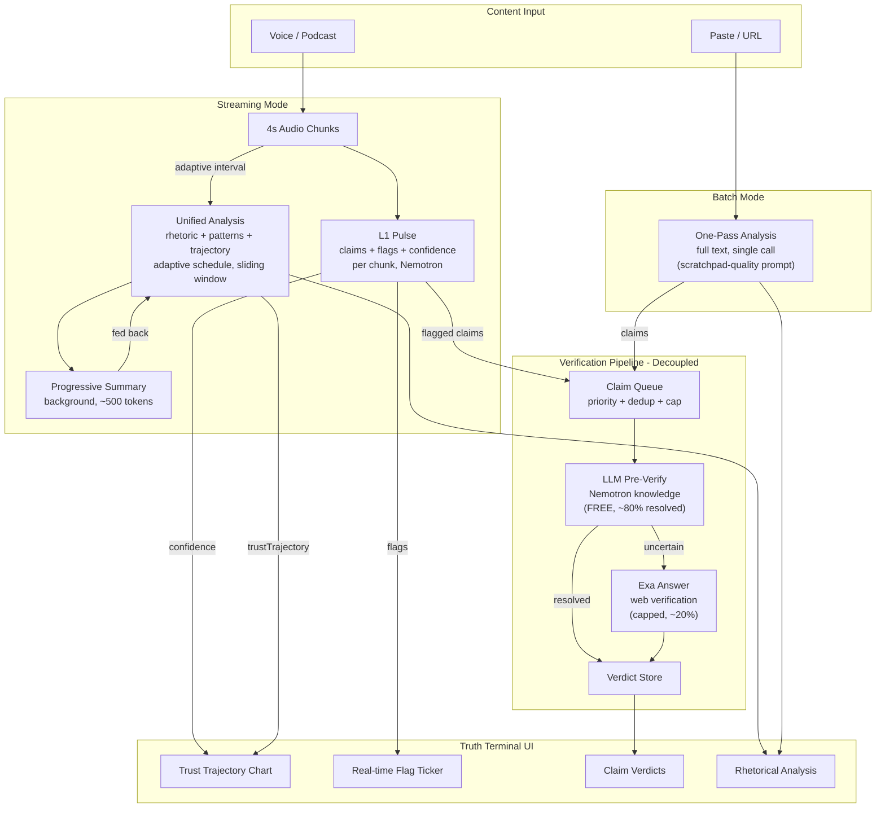
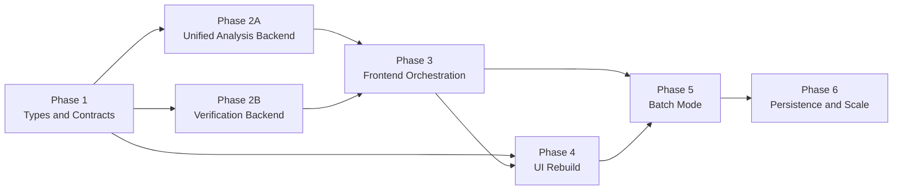

# Pipeline Rearchitecture v2: One-Pass + Truth Terminal

## The Soul of TruthLens

Every line of code, every pixel, every prompt, every label in this product flows from one belief:

**Clarity is a human right.**

When someone speaks to persuade you, you deserve to see the structure of their persuasion -- the claims, the evidence, the techniques, the gaps -- so you can think for yourself. TruthLens does not tell you what to think. It shows you how someone is trying to make you think something. You decide the rest.

There is a kid sitting in a high school debate round, watching the opposing team use emotional manipulation instead of evidence. They know something is wrong. They can feel it. But they don't have the word for it, and by the time they figure it out, the conversation has moved on. That kid grew up. The debates got bigger -- podcasts, politics, pitches, panels. The techniques got more sophisticated. But the feeling stayed the same: *something's off, and I can't say exactly what.*

TruthLens exists for that moment. The moment your gut knows before your mind catches up.

### The Tool as Amplifier, Not Authority

TruthLens is an extension of the user's own perception, not a separate intelligence passing judgment. When the trust line drops, the user should not think "the AI detected something." They should think "I noticed something." The tool validates and names. It does not discover and accuse.

This is the difference between a product people use and a product people love. A fact-checker says TRUE or FALSE. TruthLens says: here is the claim, here is what supports it, here is the technique being used, here is what's missing. Now you decide.

This is what a great teacher does. They don't give you the answer. They show you how to think about the question.

### Five Principles

**1. Name the unnamed.** The most powerful thing TruthLens does is give you the word for what you felt. "That was a straw man." "That statistic has no source." "That's false consensus." Your gut knew. Now your mind knows too. This is the moment of clarity the entire product exists to create.

**2. Silence is information.** When the screen is calm -- no flags, the line holding steady -- that calm IS the signal. It means "this person is being straight with you." The absence of alerts communicates as powerfully as their presence. A quiet screen during a rigorous passage is not a failure of the tool. It is the tool working perfectly.

**3. The speaker deserves fairness.** Every argument gets a steelman -- its strongest possible interpretation. This is not optional. It is not a nice-to-have feature. It is the thing that separates TruthLens from a gotcha toy and makes it a tool for genuine understanding. Intellectual honesty demands that we separate "I disagree with this" from "this is poorly argued."

**4. Truth is a trajectory, not a verdict.** The trust chart is a line, not a switch. Arguments have arcs. People are sometimes rigorous and sometimes sloppy, sometimes honest and sometimes careless. A speaker who starts strong and slips is fundamentally different from one who was never trying. The line captures that. A binary label never could.

**5. Respect every glance.** The user's attention is sacred. Every element on the screen must earn its presence. If it doesn't serve the moment of clarity -- the instant someone looks down and gets the answer they need -- it does not belong. One wasted glance and the user stops trusting the tool. One hundred useful glances and they can't live without it.

### How the Soul Manifests

**In prompts:** The LLM is instructed to be analytical, not adversarial. It identifies techniques, not villains. It uses precise language: "unsupported" not "false," "assertion only" not "no evidence," "unnamed attribution" not "made up source." The steelman is always generated. The analysis treats every argument as a sincere attempt at reasoning, even inflammatory ones.

**In labels and copy:** Flags describe what happened, not what the speaker is. "STAT -- no source cited" not "LIAR -- made up a number." Loading states are calm: "Analyzing..." not "Hunting for lies." Empty states invite: "Paste. Speak. See through the rhetoric." Results never condescend. The user is smart. Treat them that way.

**In color and motion:** Red means "pay attention here," not "bad person." Green means "this checks out," not "good person." Amber means "worth a closer look." Animations fire only on state changes -- never decorative, never performative. The UI is mostly still. When it moves, it means something. This is how trust is built: the tool never cries wolf.

**In the experience:** When a user turns TruthLens on themselves -- "am I doing this too?" -- the tool should feel empowering, not shaming. When the trust line holds steady for a speaker the user expected to flag, they should feel pleasantly surprised, not disappointed. The tool makes you a better listener, not a more suspicious one.

**In architecture:** Every technical decision serves the moment of clarity. Adaptive scheduling exists so the tool can sustain a 2-hour podcast without burning out. Sliding windows exist so context stays sharp without drowning in tokens. The verification pipeline exists so "unsupported" can become "supported" or "refuted" with evidence. None of this is infrastructure for its own sake. It all serves one purpose: being ready when the user glances down.

---

## What Changed From v1

The original plan had the right cost-optimization ideas (adaptive scheduling, sliding window, LLM pre-verify, Exa). This v2 keeps all of those but adds three insights from the scratchpad and user feedback:

1. **Merge L2+L3** -- the scratchpad's `route.ts` proves a single well-prompted LLM call produces analysis quality matching or exceeding our multi-pass system. Currently L3's `patternsSchema` already includes `fullAnalysis` which duplicates L2's entire output structure. Eliminating this redundancy cuts analysis API calls in half.
2. **One-pass batch mode** -- for paste/URL, skip chunked L1 entirely. One comprehensive analysis call (like the scratchpad GPT-4o route) + one verification pass. Simpler, faster, cheaper.
3. **UX-first design** -- user feedback makes clear: the real-time streaming experience IS the product. "Truth Terminal." Backend optimization is important but secondary to what users see and feel.

---

## User Feedback --> Product Requirements

From Sterling's feedback, distilled into requirements:

| User Quote                                                          | Requirement                                                                                                   |
| ------------------------------------------------------------------- | ------------------------------------------------------------------------------------------------------------- |
| "the 'truth' meter declining over 5 minutes"                        | **Trust trajectory chart updating in real-time** (currently L3 only, needs to update more frequently)         |
| "catching weird logical jumps in argumentation"                     | **L1 flags surfaced prominently** -- logic, contradiction, attribution flags are the core UX                  |
| "like a truth terminal for rhetoric"                                | **Dense, professional, information-forward layout** -- not a chatbot, a monitoring dashboard                  |
| "it's an experience, just like you can't get a summary of an album" | **The streaming animation matters** -- progressive reveal, live updating, visual feedback                     |
| "a whole podcast analyzed with a click"                             | **Batch mode** -- URL in, full analysis out, no streaming required                                            |
| "clips of 90 seconds with analysis on bottom"                       | Future: clip extraction. For now, ensure analysis data is segmented and addressable by time range             |
| "catching someone using rhetorical tricks - feels good vibe"        | **Verdicts and flags need emotional satisfaction** -- clear verdicts, color-coded, satisfying to see "caught" |

**Priority order:** real-time experience > flag/verdict display > trust trajectory > batch mode > cost optimization

---

## Architecture



**Key difference from v1:** L2 and L3 are merged into a single "Unified Analysis" endpoint. Paste/URL gets its own "One-Pass" path that skips L1 chunking entirely.

---

## Design Decision 1: Merge L2 + L3

**Why:** The current system makes two separate API calls that produce overlapping data:

- L2 (`deep/route.ts`): TLDR, corePoints, evidenceTable, appeals, assumptions, steelman, missing
- L3 (`patterns/route.ts`): patterns, trustTrajectory, overallAssessment, **fullAnalysis** (identical to L2 output)

L3 literally includes `fullAnalysis?: AnalysisResult` -- the entire L2 output nested inside L3. The scratchpad's one-pass analysis and rhetorical analyzer skill both prove a single prompt handles all of this.

**New unified endpoint:** `POST /api/analyze/route.ts`

```typescript
// Input
{ chunks: string[], runningSummary?: string, mode: "streaming" | "batch" }

// Output: UnifiedAnalysis (merged L2 + L3)
{
  // From L2
  tldr: string,
  corePoints: string[],
  underlyingStatement: string,
  evidenceTable: EvidenceRow[],
  appeals: Appeals,
  assumptions: string[],
  steelman: string,
  missing: string[],
  // From L3
  patterns: PatternEntry[],
  trustTrajectory: number[],
  overallAssessment: string,
}
```

**Prompt:** Merge [L2_SYSTEM_PROMPT](src/lib/prompts.ts) and [L3_SYSTEM_PROMPT](src/lib/prompts.ts) into one, drawing from the scratchpad's rhetorical analyzer skill structure (sections 1-8: TL;DR, Core Points, What They Actually Want to Say, Evidence/Proof Table, Rhetorical Appeals, Unexamined Assumptions, Steelman, What's Missing) plus pattern detection and trust trajectory.

**Impact:** 2-hour podcast goes from ~156 analysis calls (78 L2 + 78 L3) to ~78 unified calls. Same information, half the API calls.

---

## Design Decision 2: Two Modes

### Streaming Mode (Voice / Podcast)

The real-time experience users love. Pipeline:

1. **L1 Pulse** -- every chunk (~4s), fast. Extracts claims, flags, tone, confidence. Feeds the live flag ticker and trust chart.
2. **Unified Analysis** -- adaptive schedule (from v1 plan). Sliding window: last 20 chunks + running summary (~2,500 tokens constant). Produces full rhetorical breakdown + patterns.
3. **Progressive Summary** -- background updates running summary as chunks accumulate.
4. **Verification** -- triggered at stop + every 10 minutes + user-triggered.

### Batch Mode (Paste / URL)

Currently paste mode awkwardly reuses the streaming pipeline (chunked L1 with fixed thresholds). The scratchpad proves we can do better:

1. **Skip L1 chunking.** Send full text to the unified analysis endpoint with `mode: "batch"`.
2. **One call** produces the complete rhetorical analysis (TLDR through steelman, plus patterns and trust trajectory).
3. **Extract claims** from the analysis output (evidenceTable claims + any flagged items).
4. **Run verification** once on all extracted claims.
5. **Result:** Article analyzed in ~2 API calls (1 analysis + 1 verification batch) instead of the current N chunks x L1 + L2 at chunk 4 + L3 at chunk 6.

For URLs, the existing `/api/extract/route.ts` handles article text extraction.

---

## Design Decision 3: Verification Pipeline (kept from v1, refined)

The original plan's two-phase verification is sound. Keeping it with one refinement: verification is now a completely independent pipeline, never mixed into the analysis prompt.

### Pipeline

```
L1 flags claims (streaming) OR analysis extracts claims (batch)
  --> Claim Queue (src/lib/claim-queue.ts)
      - Priority filter: skip vague opinions, predictions
      - Fuzzy dedup: skip near-duplicates
      - Per-session cap: 10 Exa calls (configurable)
  --> LLM Pre-Verify (POST /api/verify/pre-check)
      - Nemotron evaluates from training knowledge (FREE)
      - ~80% resolved as supported/refuted/not-verifiable
  --> Exa Answer (POST /api/verify/route.ts)
      - Only "uncertain" claims reach Exa
      - Structured verdict via outputSchema
      - $5/1k requests, 1,000 free/month
  --> Verdicts rendered in UI
```

### Types (kept from v1)

```typescript
interface LLMPreVerdict {
  claim: string;
  verifiable: boolean;
  confidence: number;
  verdict: "supported" | "refuted" | "uncertain" | "not-verifiable";
  explanation: string;
  needsWebSearch: boolean;
}

interface ClaimVerdict {
  claim: string;
  verdict: "supported" | "refuted" | "unverifiable" | "partially-supported";
  confidence: number;
  explanation: string;
  source: "llm-knowledge" | "exa-web" | "unverified";
  citations?: Array<{ title: string; url: string; snippet: string }>;
}

interface VerificationResult {
  llmResolved: ClaimVerdict[];
  webVerified: ClaimVerdict[];
  unverified: string[];
  stats: { llmChecked: number; webSearched: number; totalClaims: number };
}
```

---

## Design Decision 4: Adaptive Scheduling + Sliding Window (kept from v1)

Identical to v1 plan but now applied to ONE analysis endpoint instead of two separate L2/L3 endpoints. The math improves:

**Adaptive interval function** (same as v1):

```typescript
function getAnalysisInterval(chunkCount: number): number {
  if (chunkCount < 75) return 4; // first 5 min: every 16s
  if (chunkCount < 225) return 8; // 5-15 min: every 32s
  if (chunkCount < 450) return 16; // 15-30 min: every 64s
  if (chunkCount < 900) return 32; // 30-60 min: every ~2 min
  return 64; // 60+ min: every ~4 min
}
```

**Sliding window** (same as v1, now for unified analysis):

- Last 20 chunks (~2,000 tokens) + running summary (~500 tokens) = ~2,500 tokens constant per call
- Progressive summarization runs in background via `POST /api/analyze/summarize`

**2-hour podcast cost (v2 vs v1 vs current):**

- **Current:** 449 L2 + 449 L3 = 898 calls, ~160M tokens, 1,347 Tavily searches
- **v1 plan:** 78 L2 + 78 L3 = 156 calls, ~1.25M tokens, 10 Exa searches
- **v2 plan:** 78 unified calls = **78 calls**, ~975K tokens (no L3 duplication), 10 Exa searches

v2 halves v1's analysis calls and reduces tokens further by eliminating the L3 `fullAnalysis` duplication.

---

## UI: Radical Simplification

### Design Philosophy

The product is a **peripheral monitor**, not a report reader.

During live use, the user stays focused on the speaker and gets three answers at a glance:

1. Is trust rising or falling? (the line)
2. What was the weird thing that just happened? (the latest flag)
3. Was it rhetoric, a logic issue, or a factual claim? (the flag type)

The UI should only ask for a click when the user wants more than that.

**The 2-second glance test:** A user in the middle of a debate can look down for under 2 seconds and understand: (a) that last line was sketchy, (b) here is the exact reason, (c) I can ignore the rest until I want detail.

### Disclosure Rules

Always visible during streaming:

- Trust chart (sticky, never leaves viewport)
- Stats bar (claims / flagged / verified)
- Latest flags (newest on top, above the fold)
- Transcript with severity bars (left panel)

Hidden by default during streaming (tap to expand):

- Full rhetorical breakdown (TLDR, evidence, appeals, assumptions, steelman)
- Full claim verdict list
- Pattern taxonomy (escalation, contradiction, etc.)

Open by default in batch mode (paste/URL result):

- Deep analysis
- Verdicts
- Patterns

**Critical constraint:** Deep analysis must never auto-expand during live listening. It competes with the conversation. Flags and the line are enough. Analysis is there when the user is ready, not when the system decides.

### Broadcast-Informed Design (News + Sports + Viral)

The elements viewers already know how to read at a glance -- news chyrons, sports scorebugs, tickers -- should inform every design choice. We are not inventing a new visual language. We are borrowing 30 years of trained eye behavior.

**The trust chart + stats bar = our "scorebug."** Sports broadcasts place a persistent, minimal overlay (score, clock, possession) in a fixed position. Viewers learn to glance at ONE spot. The scorebug is calm when nothing happens and spikes with color/animation on state changes (score change, shot clock red when low, penalty flag). Our trust chart + stats bar works the same way: fixed position, quiet baseline, color shift on drops.

**The flag feed = our "chyron / lower-third."** News networks use one-line banners (~55 characters max) on a high-contrast bar. Red = breaking/alert (universal since 9/11). Blue = informational. Viewers parse these in under a second without losing the main content. Our flag rows follow this pattern exactly: severity icon + flag type + quoted fragment + reason. One line. High contrast. Red for logic/contradiction, amber for stat/attribution, dim for vague/prediction.

**Calm baseline, loud events.** Both sports and news overlays are mostly stable. Motion and color changes ONLY fire on state transitions. This prevents "alert fatigue" and makes real changes feel meaningful. Our UI should be almost silent when the speaker is being rigorous -- the absence of flags is itself information.

**The "gotcha screenshot" = our Wrapped moment.** Viral UIs succeed when one frame tells the whole story without context. The shareable unit is: trust chart at a dramatic inflection + flag label naming the trick + speaker/show identification + subtle branding. This frame should work as a screenshot, a tweet embed, or a vertical clip thumbnail.

**The 90s vertical clip = our viral vector.** Sterling described it: video on top, analysis on bottom, vertical format. This is native to TikTok/Reels/Shorts. Every clip a user shares becomes a personalized demo for the next user. The viral loop is: shareable artifact -> "try your podcast" CTA -> recipient pastes their own URL -> new user.

### Visual Constraints

- Flag rows must be one-line scannable: severity icon, flag type, quoted fragment, why it matters. Target ~55 characters like a news chyron.
- The chart must update every chunk (~4s) so the screen never feels stale.
- New flags must appear above the fold; users should not hunt for the latest weird moment.
- The trust chart shape tells the story before any text is read -- the line going down IS the information.
- Color conventions: red (#ff4400) = alert/flagged (logic, contradiction). Amber (#ffaa00) = caution (stat, attribution). Green (#00cc66) = OK/supported. Dim gray = informational (vague, prediction). These map to the universal red=alert, green=safe conventions from both news and sports.
- Animations fire only on state changes (new flag, trust drop, verdict arrived), never on idle. Calm baseline, loud events.
- The "gotcha screenshot" must be designable: trust chart + latest flag + speaker/show context + branding watermark in one frame, without needing any other UI context.

The current UI has **27-28 distinct interactive elements**, **~40 section templates**, and **two parallel view modes** (Insights + Debug with 3 tabs) that show the **same data in different layouts**. The TrustChart is rendered twice. The deep analysis appears in 3 places. There is a modal architecture diagram accessible from the header.

This is the opposite of what makes someone say "holy shit."

The redesign strips everything to three ideas: **the line** (trust trajectory), **the feed** (flags appearing in real-time), and **the reveal** (deep analysis on demand). Everything else is gone.

### What We Cut

- **Debug mode entirely** -- Insights/Debug toggle, 3 debug tabs, PulseFeed, standalone AnalysisPanel, standalone PatternsPanel. One view. One experience.
- **Architecture diagram modal** -- move to docs, not the product surface.
- **3 demo buttons** -- one "Demo" button or dropdown.
- **Horizontal pulse strip** -- replaced by the flag feed (vertical, scannable, always growing).
- **Duplicate TrustChart** -- one chart, always visible.
- **"Newest left" label, timing copy, "Partial/Full transcript" badge** -- noise.
- **6 collapsible sections** -- replaced by a single expandable "Analysis" block with flat layout.
- **Tavily Sources section** -- replaced by Claim Verdicts.
- **ConfidenceMeter component** -- confidence is now the trust chart line.

**Component count: 9 components down to 4.**

Current: `page.tsx` + `TranscriptInput` + `InsightsPanel` + `AnalysisPanel` + `PatternsPanel` + `PulseFeed` + `Flag` + `ConfidenceMeter` + `ArchitectureDiagram`

New: `page.tsx` + `TranscriptInput` (simplified) + `TruthPanel` (replaces 4 panels) + `Flag`

### What Stays

- **Trust trajectory chart** -- the hero. The declining line IS the product.
- **Flag feed** -- the "catching everything" moment. Real-time, color-coded.
- **Stats bar** -- claims, flags, verified. Dense, monospace, terminal-like.
- **Deep analysis** -- TLDR, evidence, appeals, assumptions, steelman. Behind progressive disclosure.
- **Claim verdicts** -- verified/refuted indicators. The "gotcha" satisfaction.
- **Transcript with severity bars** -- left panel, color-coded edge.

---

### Layout: Empty State

The product should explain itself in one glance.

```
+------------------------------------------------------------------+
|  TRUTHLENS                                                        |
+-------------------+----------------------------------------------+
|                   |                                              |
|                   |                                              |
|  Paste a          |       Real-time rhetorical analysis.         |
|  transcript,      |                                              |
|  article, or      |       Paste. Speak. See through              |
|  URL to begin.    |       the rhetoric.                          |
|                   |                                              |
|       or          |                                              |
|                   |              [ Try a demo ]                  |
|   tap the mic     |                                              |
|                   |                                              |
|                   |                                              |
+-------------------+----------------------------------------------+
|  Paste text or URL                            [Analyze]     mic  |
+------------------------------------------------------------------+
```

One CTA. One sentence. Nothing else.

---

### Layout: Streaming / LIVE (The Hero Experience)

This is what you show Steve Jobs. Start the mic, play a podcast, watch the line.

```
+------------------------------------------------------------------+
|  TRUTHLENS                            * LIVE    8 flags    1:24  |
+-------------------+----------------------------------------------+
|                   |                                              |
|  [1] We've seen   |  TRUST                                  68  |
| | this across     |  ...__/^^^^\_/^^^\__...__/^^^\_              |
|   thousands of    |  ------------------------------------------ |
|   deployments.    |                                              |
|                   |  12 claims  .  4 flagged  .  1 verified      |
| | [2] Industry    |                                              |
|   analysts pre-   |  ! STAT   "340% improvement" -- unsourced   |
|   dict by 2027    |  ! LOGIC  "inevitable" -- false dichotomy   |
|   every Fortune   |  * OK     GDP figure checks out             |
|   500 company...  |  ! VAGUE  "thousands" -- unverifiable       |
|                   |  ! ATTR   "leading expert" -- unnamed       |
| | [3] Studies     |  . ...    analyzing chunk 4                 |
|   show 340%       |                                              |
|   improvement...  |  > Analysis   > Verdicts   > Patterns       |
|                   |                                              |
+-------------------+----------------------------------------------+
|  Recording...  ========--------  chunk 3            [  Stop  ]   |
+------------------------------------------------------------------+
```

**Right panel, top to bottom:**

1. **TRUST chart** -- full width, always visible, the hero. Single number (68) on the right edge updates every chunk. Line color shifts green/amber/red. This is "the truth meter declining over 5 minutes."
2. **Stats bar** -- one line. Claims counted, flags detected, verified. Dense, monospace, terminal-style.
3. **Flag feed** -- vertical list, newest on top, auto-scrolling. Each line: severity icon + flag type + quoted claim + why. Color-coded: red (logic/contradiction), amber (stat/attribution), dim (vague/prediction). Clicking a flag scrolls the transcript to that chunk.
4. **Progressive disclosure** -- three tappable labels at the bottom. "Analysis" expands the deep rhetorical breakdown. "Verdicts" shows claim verification results. "Patterns" shows detected rhetorical patterns. All collapsed by default during streaming.

**Left panel:**

- Transcript with color-coded severity bars on the left edge (green/amber/red per chunk, from L1 pulse severity).
- Chunk numbers in brackets.
- Auto-scrolls during recording.

**Header:** Logo + LIVE indicator + flag count + session duration. Nothing else. No model name, no "3-tier analysis" link, no view mode toggle.

**Footer:** Unified input bar. During recording: progress + Stop button. Otherwise: text input + Analyze button + mic button.

---

### Layout: Deep Analysis Expanded

When the user taps "Analysis" in the progressive disclosure row:

```
+------------------------------------------------------------------+
|  TRUTHLENS                            * LIVE    8 flags    1:24  |
+-------------------+----------------------------------------------+
|                   |                                              |
|  (transcript      |  TRUST                                  68  |
|   continues       |  ...__/^^^^\_/^^^\__...__/^^^\_              |
|   scrolling)      |  ------------------------------------------ |
|                   |                                              |
|                   |  v Analysis ------------------------------- |
|                   |                                              |
|                   |  The speaker argues technology is under      |
|                   |  unfair attack, using emotional framing      |
|                   |  to bypass evidence gaps.                    |
|                   |                                              |
|                   |  "I want you to feel victimized by tech      |
|                   |   critics so you'll join my side."           |
|                   |                                              |
|                   |  1. Tech criticism is overstated             |
|                   |  2. Historical progress proves value         |
|                   |  3. Pessimism is the real threat             |
|                   |                                              |
|                   |  EVIDENCE                                    |
|                   |  | "10x faster" -- no benchmark cited        |
|                   |  | "340% improvement" -- no study linked     |
|                   |  | "decade of research" -- assertion only    |
|                   |                                              |
|                   |  GAPS              ASSUMPTIONS               |
|                   |  * No benchmarks   * Tech = always good      |
|                   |  * No user data    * Critics = all wrong     |
|                   |                                              |
|                   |  APPEALS   [ethos]  [pathos]  [logos]        |
|                   |                                              |
|                   |  STEELMAN                                    |
|                   |  Technology has historically improved lives   |
|                   |  and unwarranted pessimism can slow          |
|                   |  beneficial progress.                        |
|                   |                                              |
|                   |  > Verdicts   > Patterns                     |
|                   |                                              |
+-------------------+----------------------------------------------+
|  Recording...  ========--------  chunk 12           [  Stop  ]   |
+------------------------------------------------------------------+
```

The analysis section scrolls within the right panel. The trust chart remains sticky at the top -- it never leaves the viewport. This is critical: the "truth meter" is always visible even while reading the deep analysis.

The analysis layout is flat (not collapsible accordions). Sections flow naturally: TLDR, underlying statement (red/highlighted), core points, evidence table, gaps + assumptions side by side, appeals toggle, steelman. Matches the scratchpad's rhetorical analyzer skill structure.

---

### Layout: Batch Result (Paste / URL)

For articles and pasted text -- no streaming, instant result:

```
+------------------------------------------------------------------+
|  TRUTHLENS                              12 claims   4 flagged    |
+-------------------+----------------------------------------------+
|                   |                                              |
|  (full article    |  TRUST                                  72  |
|   text displayed  |  ...__/^^^^\_/^^^\__...__/^^^\_              |
|   with severity   |  ------------------------------------------ |
|   bars per        |                                              |
|   paragraph)      |  The speaker argues technology is under      |
|                   |  unfair attack, using emotional framing      |
|                   |  to bypass evidence gaps.                    |
|                   |                                              |
|                   |  "I want you to feel victimized by tech      |
|                   |   critics so you'll join my side."           |
|                   |                                              |
|                   |  1. Tech criticism is overstated             |
|                   |  2. Historical progress proves value         |
|                   |  3. Pessimism is the real threat             |
|                   |                                              |
|                   |  EVIDENCE                                    |
|                   |  | "10x faster" -- no benchmark cited        |
|                   |  | "340% improvement" -- no study linked     |
|                   |                                              |
|                   |  APPEALS   [ethos]  [pathos]  [logos]        |
|                   |                                              |
|                   |  VERDICTS                                    |
|                   |  * "GDP grew 3.2%" -- supported (web)       |
|                   |  x "Everyone agrees" -- refuted (LLM)       |
|                   |  ? "50% of jobs" -- unverified [Verify]     |
|                   |                                              |
|                   |  PATTERNS                                    |
|                   |  ! escalation   ! cherry-picking             |
|                   |                                              |
+-------------------+----------------------------------------------+
|  Paste text or URL                            [Analyze]     mic  |
+------------------------------------------------------------------+
```

In batch mode, the deep analysis is **open by default** (no progressive disclosure needed -- the result is the product). The trust chart still appears at top for visual impact, but everything below it is immediately visible and scrollable.

---

### Layout: Claim Verdicts Expanded

When the user taps "Verdicts" during or after streaming:

```
+----------------------------------------------+
|                                              |
|  v Verdicts -------------------------------- |
|                                              |
|  3 supported  .  1 refuted  .  7 unverified  |
|                                              |
|  * "GDP grew 3.2% in Q3"                    |
|    supported -- matches BEA data             |
|    source: exa-web  .  bea.gov               |
|                                              |
|  x "Everyone agrees this is inevitable"      |
|    refuted -- classic false consensus        |
|    source: llm-knowledge                     |
|                                              |
|  ? "AI will replace 50% of jobs by 2027"    |
|    unverified                   [ Verify ]   |
|                                              |
|  ? "340% productivity improvement"           |
|    unverified                   [ Verify ]   |
|                                              |
|  > Analysis   > Patterns                     |
|                                              |
+----------------------------------------------+
```

Each verdict: icon (\* supported, x refuted, ? unverified) + quoted claim + one-line explanation + source. Unverified claims get a "Verify" button for on-demand web search (uses Exa, counts against session cap).

---

### Data Update Cadence (What Moves When)

Understanding what updates when is critical for which elements feel "alive":

- **Every ~4s** (per L1 chunk): Trust chart gets a new point. Flag feed gets new entries. Stats bar counts update. Transcript grows.
- **Every 16s-4min** (per unified analysis): TLDR, core points, evidence, appeals, assumptions, steelman, patterns, overall assessment all replace. Trust trajectory gets a smoother overlay.
- **On verification** (at stop + periodic + user-triggered): Verdicts accumulate. Stats bar "verified" count updates.

The trust chart uses a **client-derived live score** (EMA of L1 confidence weighted by flag severity) for per-chunk updates, with the analysis-provided `trustTrajectory` overlaid as a smoother reference line when available. This means the chart is always moving during streaming -- never stale.

---

## Use Cases & Viral Loop

### Sterling's Use Cases (distilled from feedback)

- **Live podcast companion** -- BS meter running while listening. The core product.
- **"Podcast wrapper"** -- default listening layer for every show. Habit-forming.
- **Gotcha / vindication** -- catching rhetorical tricks. The emotional payoff.
- **Argument arc tracking** -- watching the truth meter decline over 5 minutes. The narrative.
- **Positive validation** -- pleasant surprise when a show is consistent. Not just cynicism.
- **Self-analysis** -- "am I doing this too?" on own podcast appearances. Growth tool.
- **One-shot full episode** -- whole podcast analyzed with a click. Batch mode.
- **Short-form clips** -- 90s vertical: video top, analysis bottom. The viral vector.
- **Discovery / lead magnet** -- "analyze a podcast of your choice" + paste YouTube link. Acquisition.

### The Viral Loop

```
User analyzes a podcast
  -> screenshots the "gotcha moment" (trust dip + flag label)
  -> shares on Twitter/TikTok/Discord
  -> viewer sees the screenshot, recognizes the speaker/show
  -> clicks through to TruthLens
  -> "Analyze YOUR podcast" CTA -> pastes their own URL
  -> new user -> repeat
```

The shareable artifact IS the acquisition channel. Every gotcha screenshot, every vertical clip, every "look what it caught" tweet is a personalized demo for the next user.

### The Gotcha Screenshot (designed as a share unit)

The single frame that gets shared must contain, without any other context:

- **Trust chart at a dramatic inflection** (the line visibly dropping)
- **The flag that caused it** (severity icon + type + quoted claim + reason)
- **Speaker/show identification** (episode title, timestamp, or thumbnail)
- **Subtle TruthLens branding** (watermark or URL, not intrusive)
- **Works at phone width** -- must survive Twitter/TikTok compression

This is TruthLens's equivalent of the Spotify Wrapped card: one image, one story, shareable without explanation.

---

## Phased Execution Plan

### Dependency Graph



### Phase 1: Types & Contracts (1 engineer, ~1-2 hours)

Foundation layer. Everything else depends on these type definitions, schemas, and prompts. All 4 tasks are parallelizable within the phase.

- `p1-types` -- Define `UnifiedAnalysis`, `LLMPreVerdict`, `ClaimVerdict`, `VerificationResult`, `SessionSummary` in [types.ts](src/lib/types.ts). Remove `TavilySource`, `AnalysisResult`, `PatternsResult`.
- `p1-schemas` -- Replace `analysisSchema` + `patternsSchema` with `unifiedAnalysisSchema` in [schemas.ts](src/lib/schemas.ts). Add verification and summary schemas.
- `p1-prompt-analysis` -- Write merged `ANALYSIS_SYSTEM_PROMPT` in [prompts.ts](src/lib/prompts.ts) combining L2+L3 with scratchpad rhetorical analyzer structure.
- `p1-prompt-verify` -- Write `LLM_PRE_VERIFY_PROMPT` and `SUMMARY_PROMPT` in [prompts.ts](src/lib/prompts.ts).

**Files touched:** `types.ts`, `schemas.ts`, `prompts.ts`

### Phase 2A: Unified Analysis Backend (1 engineer, ~2-3 hours)

Depends on Phase 1. Parallelizable with Phase 2B.

- `p2a-unified-route` -- Rewrite [deep/route.ts](src/app/api/analyze/deep/route.ts) as unified endpoint. Remove Tavily imports. Accept `runningSummary` + `mode`. Return `UnifiedAnalysis`.
- `p2a-delete-patterns` -- Delete [patterns/route.ts](src/app/api/analyze/patterns/route.ts).
- `p2a-adaptive-scheduler` -- Create `src/lib/adaptive-scheduler.ts` with `getAnalysisInterval(n)` and `shouldRunAnalysis(n, lastRanAt)`.
- `p2a-summarize-route` -- Create `/api/analyze/summarize/route.ts` for progressive summary maintenance.

**Files touched:** `deep/route.ts` (rewrite), `patterns/route.ts` (delete), new `adaptive-scheduler.ts`, new `summarize/route.ts`

### Phase 2B: Verification Backend (1 engineer, ~2-3 hours)

Depends on Phase 1. Parallelizable with Phase 2A.

- `p2b-exa-client` -- Create `src/lib/exa.ts` with Exa JS SDK, `verifyClaim()` using Answer endpoint + `outputSchema`. Run `bun add exa-js`.
- `p2b-claim-queue` -- Create `src/lib/claim-queue.ts` with priority filter, fuzzy dedup, per-session cap.
- `p2b-preverify-route` -- Create `/api/verify/pre-check/route.ts` for LLM-only claim verification.
- `p2b-verify-route` -- Create `/api/verify/route.ts` orchestrating claim queue + pre-check + Exa fallback.
- `p2b-remove-tavily` -- Delete `src/lib/tavily.ts`. Swap `TAVILY_API_KEY` for `EXA_API_KEY` in env.

**Files touched:** new `exa.ts`, new `claim-queue.ts`, new `verify/pre-check/route.ts`, new `verify/route.ts`, `tavily.ts` (delete)

### Phase 3: Frontend Orchestration (1 engineer, ~3-4 hours)

Depends on Phase 2A + 2B (needs both API contracts stable). Sequential -- single engineer rewires the main page.

- `p3-page-orchestration` -- Rewrite [page.tsx](src/app/page.tsx). Remove `viewMode`/Debug/tabs/`showArch`. Replace `triggerL2`+`triggerL3` with single `triggerAnalysis`. Replace `analysisResult` + `patternsResult` state with single `analysis: UnifiedAnalysis | null`. Add adaptive scheduler using `getAnalysisInterval`. Add sliding-window refs (`runningSummary`, `recentChunks`). Replace `voiceLastL2AtChunkCountRef` + `voiceLastL3AtChunkCountRef` with single `lastAnalysisAtRef`.
- `p3-wire-verify` -- Wire verification into page.tsx. Add `verdicts: VerificationResult | null` state. Trigger at stop + every 10 min for long sessions + user-triggered via "Verify" button. Pass verdicts to TruthPanel.

**Files touched:** `page.tsx` (major rewrite)

### Phase 4: UI Rebuild (1-2 engineers, ~3-4 hours)

Can start scaffolding after Phase 1 (types defined). Final wiring after Phase 3 (page.tsx props stable). The TruthPanel build and TranscriptInput simplification are parallelizable.

- `p4-truth-panel` -- Create `src/app/components/TruthPanel.tsx`. Sticky trust chart (SVG, EMA-based live score + analysis overlay). Stats bar. Flag feed (vertical, color-coded, clickable). Progressive disclosure: Analysis / Verdicts / Patterns sections.
- `p4-simplify-input` -- Simplify [TranscriptInput.tsx](src/app/components/TranscriptInput.tsx). 3 demo buttons to 1 dropdown. Remove voice timing copy. Clean footer states.
- `p4-delete-old-components` -- Delete `InsightsPanel.tsx`, `AnalysisPanel.tsx`, `PatternsPanel.tsx`, `PulseFeed.tsx`, `ConfidenceMeter.tsx`, `ArchitectureDiagram.tsx`.

**Files touched:** new `TruthPanel.tsx`, `TranscriptInput.tsx` (simplify), 6 files deleted

### Phase 5: Batch Mode (1 engineer, ~2 hours)

Depends on Phase 3 + 4 (page orchestration and TruthPanel must exist).

- `p5-batch-mode` -- Add batch path in page.tsx: for paste/URL, skip L1 chunking, send full text to unified analysis with `mode: "batch"`. Extract claims from analysis output for verification. In TruthPanel, open analysis by default when batch result arrives.

**Files touched:** `page.tsx` (add batch branch), `TruthPanel.tsx` (batch-open logic), `deep/route.ts` (batch mode handler)

### Phase 6: Persistence & Scale (future)

Depends on all prior phases being stable.

- `p6-youtube` -- YouTube transcript ingestion for podcast URLs. Clip extraction (90s vertical format). Brave Search fallback.
- `p6-persistence` -- Persistence layer TBD. If needed during prototype: localStorage for session history. Backend persistence deferred until prototype stabilizes.

**Files touched:** new ingestion routes, TBD persistence

### Parallelization Summary

```
Time -->

Engineer A:  [--- Phase 1 ---][--- Phase 2A ---][--- Phase 3 ----------][ Phase 5 ]
Engineer B:                   [--- Phase 2B ---]
Engineer C:            [-- Phase 4 scaffold --] [-- Phase 4 finalize --]
```

- Phase 1 is the critical path starter (1 engineer, fast)
- Phase 2A and 2B run in parallel (2 engineers)
- Phase 4 scaffolding can start during Phase 2 (TruthPanel with mock data)
- Phase 3 is the bottleneck (single engineer, depends on both 2A + 2B)
- Phase 4 finalization and Phase 5 follow Phase 3

**Estimated total with 2-3 engineers: ~1-2 days**
**Estimated total with 1 engineer sequential: ~2-3 days**

---

## File Changes

### New files

- **`src/lib/exa.ts`** -- Exa client with `verifyClaim()` using Answer endpoint + `outputSchema`
- **`src/lib/claim-queue.ts`** -- Priority filter, fuzzy dedup, per-session cap
- **`src/lib/adaptive-scheduler.ts`** -- `getAnalysisInterval(n)`, `shouldRunAnalysis(n, lastRanAt)`
- **`src/app/api/verify/route.ts`** -- Orchestrates LLM pre-check then Exa web search
- **`src/app/api/verify/pre-check/route.ts`** -- LLM-only claim verification
- **`src/app/api/analyze/summarize/route.ts`** -- Progressive summary maintenance

### New components

- **`src/app/components/TruthPanel.tsx`** -- Replaces InsightsPanel, AnalysisPanel, PatternsPanel, and PulseFeed. Single component: sticky trust chart + stats bar + flag feed + progressive disclosure sections (Analysis, Verdicts, Patterns).

### Modified files

- **[src/app/api/analyze/deep/route.ts](src/app/api/analyze/deep/route.ts)** -- Becomes the unified analysis endpoint. Remove Tavily. Remove `claims` param. Accept `runningSummary` and `mode` params. Return merged schema (rhetoric + patterns + trajectory). For batch mode, accept full text directly.
- **[src/app/page.tsx](src/app/page.tsx)** -- (a) Remove `viewMode` state, Debug mode, tab system, and `showArch`. (b) Replace separate `analysisResult` + `patternsResult` with single `analysis: UnifiedAnalysis`. (c) Replace `triggerL2`/`triggerL3` with single `triggerAnalysis`. (d) Add adaptive scheduler, sliding-window state, verification state. (e) Add batch mode path for paste/URL. (f) Render `TruthPanel` instead of conditional Insights/Debug views.
- **[src/app/components/TranscriptInput.tsx](src/app/components/TranscriptInput.tsx)** -- Replace 3 demo buttons with single "Demo" button/dropdown. Remove voice timing copy. Simplify footer states.
- **[src/lib/types.ts](src/lib/types.ts)** -- Add `UnifiedAnalysis`, `LLMPreVerdict`, `ClaimVerdict`, `VerificationResult`, `SessionSummary`. Remove `TavilySource`. Remove `PatternsResult` and `AnalysisResult` (replaced by `UnifiedAnalysis`). Keep `PulseResult`, `PulseEntry`, `PulseFlag`.
- **[src/lib/schemas.ts](src/lib/schemas.ts)** -- Replace `analysisSchema` + `patternsSchema` with `unifiedAnalysisSchema`. Add verification schemas.
- **[src/lib/prompts.ts](src/lib/prompts.ts)** -- Replace `L2_SYSTEM_PROMPT` + `L3_SYSTEM_PROMPT` with single `ANALYSIS_SYSTEM_PROMPT`. Add `LLM_PRE_VERIFY_PROMPT` and `SUMMARY_PROMPT`.

### Removed files

- **`src/lib/tavily.ts`** -- Replaced by `src/lib/exa.ts`
- **`src/app/api/analyze/patterns/route.ts`** -- Merged into unified analysis endpoint
- **`src/app/components/InsightsPanel.tsx`** -- Replaced by `TruthPanel.tsx`
- **`src/app/components/AnalysisPanel.tsx`** -- Replaced by `TruthPanel.tsx`
- **`src/app/components/PatternsPanel.tsx`** -- Replaced by `TruthPanel.tsx`
- **`src/app/components/PulseFeed.tsx`** -- Flag feed in `TruthPanel.tsx` replaces this
- **`src/app/components/ConfidenceMeter.tsx`** -- Confidence is now the trust chart line
- **`src/app/components/ArchitectureDiagram.tsx`** -- Moved to docs, not the product surface

---

## Migration Path

**Phase 1 (this PR):** Merge L2+L3 + adaptive scheduling + sliding window + UI radical simplification (TruthPanel). Remove Tavily, add Exa. Verification pipeline. This alone gets from less than 1 to ~100+ two-hour sessions/month on free tier, and from 9 components to 4.

**Phase 2:** Batch mode for paste/URL (skip L1, single analysis call, analysis open by default).

**Phase 3 (Persistence):** Deferred. If needed during prototype, localStorage for session history. Backend persistence TBD when prototype stabilizes.

**Phase 4 (Scale):** YouTube transcript ingestion for podcast URLs. Clip extraction (90s vertical format). Brave Search fallback. Tiered verification caps.
