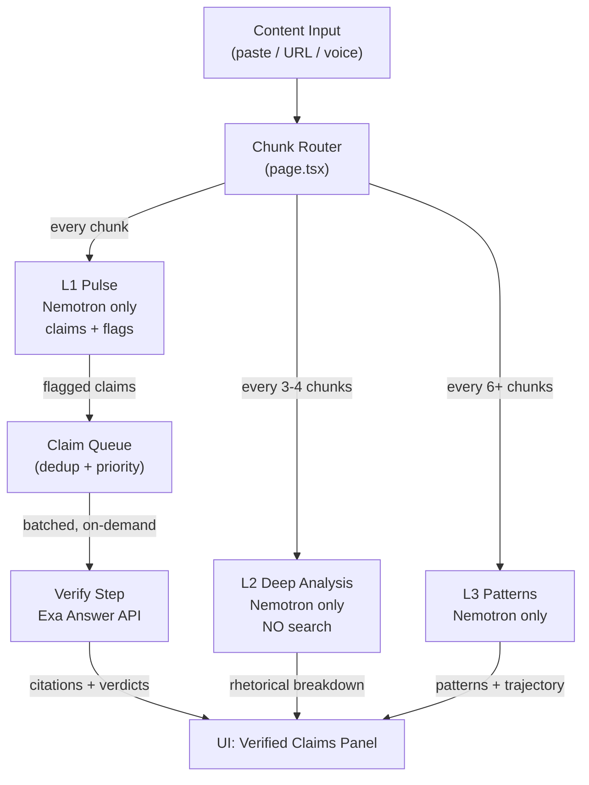

# Search & Verification Cost Optimization

## The Cost Problem

The current architecture couples Tavily search into every L2 Deep Analysis call. Here is the math for a 5-minute voice session (75 chunks at 4s each):

- **L2 triggers:** chunks 8, 12, 16, 20, 24, ... 72 = **17 L2 calls** (first at 8, then every +4)
- **Each L2 call:** up to 3 Tavily `advanced` searches
- **Total Tavily requests per session:** 17 x 3 = **51 requests**
- **With 1,000 free requests/month:** 1000 / 51 = **~19 sessions before exhausting the free tier**

A user transcribing two 5-min clips a week would blow through the budget in 2 weeks. Paste mode is less severe (~3 requests per article), but voice is the flagship experience.

### Root Causes

1. **Verification is fused into L2.** Every L2 call triggers searches, even though L2's primary job is rhetorical analysis (LLM-only work).
2. **Redundant searches.** Claims verified at chunk 8 get re-verified at chunk 12, 16, etc. No dedup, no cache.
3. **All claims searched equally.** Vague opinions and unfalsifiable predictions get searched alongside hard factual claims.
4. **`advanced` depth used for all searches.** Costs 2 Tavily credits per call vs 1 for `basic`.
5. **L2 fires too frequently in voice mode.** Every 16 seconds is aggressive for a step that triggers expensive external calls.

---

## Proposed Architecture: Decouple Verification from Analysis



**Key change:** L2 becomes pure LLM (like L1 and L3). A new **Verify** step handles all search, runs independently, and is optimized for minimal API calls.

---

## Search Provider Comparison

Based on benchmarks and pricing as of March 2026:

- **Tavily (current):** 1,000 credits/mo free. $5/1k basic, $8/1k advanced. Acquired by Nebius (same infra as our Nemotron). 71% accuracy on complex retrieval (WebWalker). Latency ~1-4.5s.
- **Exa Search:** 1,000 requests/mo free. $7/1k requests (includes text + highlights for 10 results). 81% accuracy on complex retrieval. Latency ~1.2s. Semantic search excels at claim verification.
- **Exa Answer:** Shares the free pool. **$5/1k answers.** Returns a direct answer + citations in one call. Ideal for "Is this claim true?" queries. Supports `outputSchema` for structured responses.
- **Brave Search:** $5 free credit/mo (~1,000 queries). $5/1k requests. 30B+ page index. Sub-200ms latency. Independent index (not Google/Bing). Best as overflow/fallback.

### Recommendation: **Exa Answer as primary, Brave as fallback**

- Exa Answer is purpose-built for fact-checking: one call = answer + citations. No need to search + parse + send to LLM.
- Exa's `outputSchema` lets us get structured verdicts (`{ verified: bool, confidence: number, explanation: string }`) directly.
- Exa scored 10 points higher than Tavily on complex retrieval benchmarks.
- Exa has an open-source [hallucination detector](https://github.com/exa-labs/exa-hallucination-detector) that does exactly what TruthLens verification does.
- Brave provides ~1,000 extra free requests/mo as overflow. Combined: **~2,000 free searches/month.**

---

## Verify Step Design

### 1. Claim Queue with Priority Filtering

Only claims flagged by L1 get queued for verification. Priority tiers:

| L1 Flag Type    | Priority | Search? | Rationale                                       |
| --------------- | -------- | ------- | ----------------------------------------------- |
| `stat`          | HIGH     | Yes     | Stats without sources are verifiable            |
| `attribution`   | HIGH     | Yes     | "Studies show..." is checkable                  |
| `logic`         | MEDIUM   | Yes     | Logical fallacies benefit from counter-evidence |
| `contradiction` | MEDIUM   | Yes     | Cross-reference earlier claims                  |
| `vague`         | LOW      | No      | "Things are getting better" is not searchable   |
| `prediction`    | LOW      | No      | Future claims are unfalsifiable                 |

This alone cuts the search volume roughly in half.

### 2. Deduplication

Before searching, deduplicate similar claims. Two strategies:

- **Exact/fuzzy match:** Simple string similarity (e.g., Levenshtein or normalized overlap) catches near-duplicates from consecutive chunks.
- **LLM-assisted grouping (optional):** Ask Nemotron to group related claims into verification queries. E.g., three claims about "AI market size" become one search: "What is the AI market size in 2026?"

### 3. Batching Strategy

| Mode            | When Verify Runs                     | Expected Exa Calls |
| --------------- | ------------------------------------ | ------------------ |
| Voice (5 min)   | At stop + once mid-session (~60s in) | 5-15 calls         |
| Voice (10+ min) | At stop + every ~90s                 | 10-25 calls        |
| Paste           | Once after all chunks processed      | 3-10 calls         |
| URL             | Once after extraction + analysis     | 3-10 calls         |

### 4. Per-Session Claim Cap

Hard cap of **10-15 verified claims per session** (configurable). After the cap, queue remaining claims but show them as "unverified" rather than burning more API calls. This guarantees:

- **1000 / 15 = ~66 sessions/month** at minimum (vs ~19 today)
- With dedup typically reducing to ~8 claims: **1000 / 8 = ~125 sessions/month** (6x improvement)
- Adding Brave fallback: **~250 sessions/month** (12x improvement)

### 5. In-Memory Cache

Cache `claim_hash -> verification_result` for the session. If a user re-analyzes similar content or a claim recurs across chunks, skip the search.

---

## Implementation Changes

### New files

- `src/lib/exa.ts` -- Exa client wrapper (replace `src/lib/tavily.ts`)
- `src/lib/claim-queue.ts` -- Priority queue, dedup, batching logic
- `src/app/api/verify/route.ts` -- New verification endpoint

### Modified files

- [src/app/api/analyze/deep/route.ts](src/app/api/analyze/deep/route.ts) -- **Remove all Tavily search logic.** L2 becomes pure LLM analysis. Remove `claims` from request body. Remove `sources` from response.
- [src/app/page.tsx](src/app/page.tsx) -- Add `verificationResult` state. Wire claim queue. Call `/api/verify` on batch triggers (stop, interval). Pass verification results to InsightsPanel/AnalysisPanel.
- [src/lib/types.ts](src/lib/types.ts) -- Add `VerificationResult`, `ClaimVerdict`, `VerifiedClaim` types. Update `AnalysisResult` to remove `sources`.
- [src/lib/schemas.ts](src/lib/schemas.ts) -- Add `verificationSchema` for Exa Answer output.
- [src/app/components/InsightsPanel.tsx](src/app/components/InsightsPanel.tsx) -- Add verified claims section with citations.
- [src/app/components/AnalysisPanel.tsx](src/app/components/AnalysisPanel.tsx) -- Replace Tavily Sources section with Verified Claims.

### New data types

```typescript
interface ClaimVerdict {
  claim: string;
  verdict: "supported" | "refuted" | "unverifiable" | "partially-supported";
  confidence: number;
  explanation: string;
  citations: Array<{ title: string; url: string; snippet: string }>;
}

interface VerificationResult {
  verifiedClaims: ClaimVerdict[];
  unverifiedClaims: string[];
  provider: "exa" | "brave";
  totalSearches: number;
}
```

### Exa client (`src/lib/exa.ts`)

```typescript
import Exa from "exa-js";

const exa = new Exa(process.env.EXA_API_KEY);

export async function verifyClaim(claim: string): Promise<ClaimVerdict> {
  const response = await exa.answer(
    `Is the following claim true or false? Provide evidence. Claim: "${claim}"`,
    { text: true },
  );
  // Parse response.answer + response.citations into ClaimVerdict
}
```

### Verify endpoint (`src/app/api/verify/route.ts`)

- Input: `{ claims: string[], flags: PulseFlag[] }`
- Filters to HIGH/MEDIUM priority flags only
- Deduplicates claims
- Caps at 10-15 Exa Answer calls
- Falls back to Brave Search if Exa quota detected as low (optional future enhancement)
- Returns: `VerificationResult`

---

## Cost Summary

| Scenario                   | Current (Tavily) | Proposed (Exa + batching) | Improvement |
| -------------------------- | ---------------- | ------------------------- | ----------- |
| 5-min voice session        | ~51 searches     | ~8-15 searches            | 3-6x        |
| 10-min voice session       | ~100+ searches   | ~15-25 searches           | 4-7x        |
| Paste (10 chunks)          | ~3 searches      | ~3-5 searches             | Same        |
| Sessions/month (free tier) | ~19 voice        | ~66-125 voice             | 3-6x        |
| With Brave fallback        | ~19 voice        | ~130-250 voice            | 7-13x       |

---

## Migration Path

Phase 1 (this PR): Decouple verification from L2, add Exa Answer, add claim queue with priority/dedup/cap. Remove Tavily.

Phase 2 (with Convex): Persist verification results in Convex `analyses` table. Cache across sessions. Track `searchesUsed` in `usageLimits` for paywall gating.

Phase 3 (scale): Add Brave Search as fallback provider. Implement provider rotation based on remaining monthly quota.
