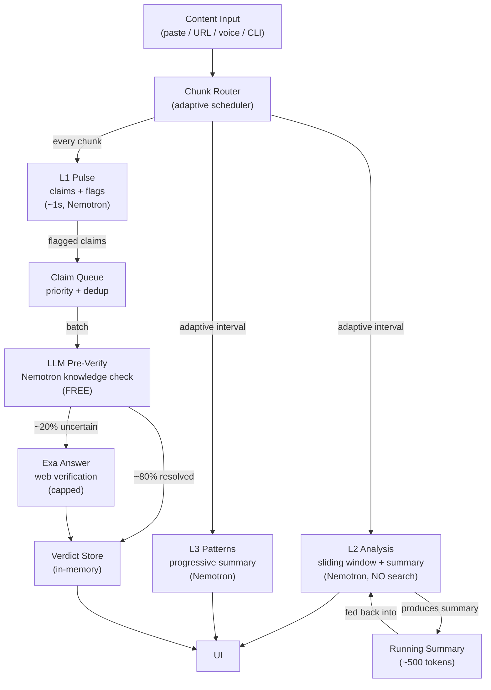

# Pipeline Rearchitecture for Long-Form Content & CLI

## The Real Cost Problem

The previous plan assumed 5-minute voice clips. Real usage is **2-hour podcasts**, **YouTube videos**, and **CLI batch processing of articles**. Here is the math at current settings:

### 2-Hour Podcast (voice mode)

- 7,200s / 4s = **1,800 chunks**
- L2 fires every 4 chunks after chunk 8 = **449 L2 calls**
- Each L2 call sends the **entire transcript** (grows to ~180k tokens by hour 2)
- Each L2 call triggers up to 3 Tavily searches = **1,347 Tavily requests**
- **Tavily:** 1,347 requests in ONE session (exceeds the 1,000/mo free tier)
- **Nemotron inference:** 449 L2 calls x ~180k avg tokens = **~80M input tokens** for L2 alone
- L3 is similar = another ~80M tokens
- **Total inference for one session: ~160M input tokens** (at ~$0.20/M, that is ~$32 per session)

### CLI Batch (50 articles/day)

- 50 articles x 10 chunks x 3 Tavily searches = **150 searches/day**, **4,500/month**

### Root Causes (expanded from v1)

1. **Fixed-interval L2/L3 scheduling.** Every 16 seconds regardless of session length. Designed for 5-min demos.
2. **Full-transcript context on every call.** L2 and L3 send ALL accumulated chunks. By hour 2, each call processes 180k tokens.
3. **Verification fused into L2.** Every L2 call triggers web searches.
4. **No claim triage.** Vague opinions searched alongside hard stats.
5. **No LLM pre-verification.** Nemotron already knows many facts but is never asked.
6. **No dedup or caching.** Same claims re-verified every 16 seconds.

---

## Proposed Architecture



Three independent improvements that multiply together:

1. **Adaptive scheduling** -- L2/L3 fire less often as session grows (100-800x token reduction)
2. **Sliding-window context** -- L2/L3 see recent chunks + compact summary, not full transcript (constant context size)
3. **Two-phase verification** -- LLM resolves 80% of claims for free, Exa handles the rest (50-100x search reduction)

---

## Change 1: Adaptive L2/L3 Scheduling

Replace fixed intervals with a scheduler that scales with session length.

**Current** ([src/app/page.tsx](src/app/page.tsx) lines 24-31):

```
VOICE_L2_FIRST_CHUNKS = 8    // first L2 at chunk 8 (~32s)
VOICE_L2_ROLL_EVERY = 4      // then every 4 chunks (16s) FOREVER
VOICE_L3_FIRST_CHUNKS = 6
VOICE_L3_ROLL_EVERY = 4      // same
```

**Proposed:** Interval grows with chunk count.

```typescript
function getInterval(chunkCount: number): number {
  if (chunkCount < 75)   return 4;   // first 5 min: every 16s (responsive)
  if (chunkCount < 225)  return 8;   // 5-15 min: every 32s
  if (chunkCount < 450)  return 16;  // 15-30 min: every 64s
  if (chunkCount < 900)  return 32;  // 30-60 min: every ~2 min
  return 64;                          // 60+ min: every ~4 min
}
```

**Impact on a 2-hour session:**

- Current: 449 L2 calls + 449 L3 calls = **898 total**
- Proposed: ~17 + 19 + 14 + 14 + 14 = **~78 L2 calls**, similar for L3 = **~156 total**
- **5.7x reduction in LLM calls alone**

---

## Change 2: Sliding-Window Context for L2/L3

Instead of sending the entire transcript (which grows to 180k tokens), send:

**L2 sliding window:**

- Last 20 chunks (~80s of content) = ~2,000 tokens
- Running summary of all prior content = ~500 tokens
- Total per L2 call: **~2,500 tokens (constant)**

**L3 progressive summary:**

- Full transcript of last 5 minutes = ~7,500 tokens
- Condensed summary of everything before that = ~2,000 tokens
- Total per L3 call: **~10,000 tokens (constant)**

**New route for progressive summarization:**

```
POST /api/analyze/summarize
Input: { newChunks: string[], existingSummary: string }
Output: { summary: string }  // ~500 tokens
```

Runs in the background, updates the running summary as chunks accumulate. Uses Nemotron with a tight prompt: "Update this running summary with the new content. Keep it under 500 tokens."

**Impact on inference tokens (2-hour session):**

- Current L2: 449 calls x ~90k avg tokens = **~40M tokens**
- Proposed L2: 78 calls x 2,500 tokens = **~195k tokens** (200x reduction)
- Current L3: 449 calls x ~90k avg tokens = **~40M tokens**
- Proposed L3: 78 calls x 10,000 tokens = **~780k tokens** (50x reduction)
- Summary maintenance: ~90 calls x 3,000 tokens = **~270k tokens**
- **Total: ~1.25M tokens vs ~80M+ tokens (64x reduction)**

---

## Change 3: Two-Phase Verification (LLM-First)

Backed by recent research ("Fact-Checking Without Retrieval", arxiv 2603.05471; "ClaimCheck", arxiv 2510.01226; "Hybrid Fact-Checking", arxiv 2511.03217) showing LLMs can verify claims from internal knowledge with 80%+ accuracy, using web search only as fallback for uncertain claims.

### Phase A: LLM Pre-Verification (FREE)

```
POST /api/verify/pre-check
Input: { claims: ClaimWithFlag[] }
Output: { verdicts: LLMPreVerdict[] }
```

Sends flagged claims to Nemotron with this prompt pattern:

```
For each claim, assess using ONLY your training knowledge:
1. Is this claim verifiable? (yes/no)
2. Your confidence in its accuracy (0.0-1.0)
3. Your preliminary verdict (supported/refuted/uncertain)
4. Brief explanation

Claims that are opinions, predictions, or too vague to verify:
mark as "not-verifiable" -- these will NOT be web-searched.

Claims where your confidence is below 0.5:
mark as "needs-web-search" -- these will be escalated.
```

**Expected result:** ~80% of claims resolved without any web search. Only truly uncertain factual claims get escalated.

### Phase B: Exa Web Verification (CAPPED)

Only claims marked `needs-web-search` by Phase A reach Exa.

```typescript
const response = await exa.answer(
  `Is this claim accurate? Provide evidence for or against: "${claim}"`,
  {
    text: true,
    outputSchema: {
      type: "object",
      properties: {
        verdict: { type: "string", enum: ["supported", "refuted", "partially-supported", "unverifiable"] },
        confidence: { type: "number" },
        explanation: { type: "string" },
      },
      required: ["verdict", "confidence", "explanation"]
    }
  }
);
```

Exa Answer costs $5/1k requests. Returns answer + citations in one call. Supports `outputSchema` for structured verdicts directly.

### Claim Queue Pipeline

```
L1 flags claim
  → Priority filter (skip vague/prediction)
  → Fuzzy dedup (skip near-duplicates)
  → LLM Pre-Verify (Phase A, free)
  → Only "uncertain" claims → Exa Answer (Phase B, capped)
  → Verdicts rendered in UI
```

### Verification Triggers

- **Voice mode:** At stop + every 10 minutes for long sessions + user-triggered "Verify" button
- **Paste/URL mode:** Once after all chunks processed
- **CLI mode:** Once per article
- **On-demand:** User clicks any claim to trigger immediate web verification

### Per-Session Caps

- **LLM pre-verify:** Unlimited (free Nemotron inference)
- **Exa web searches:** Hard cap of **10 per session** (configurable per plan tier)
- After cap: remaining uncertain claims shown as "unverified -- click to verify" (user-triggered uses the cap)

---

## Cost Comparison

### 2-Hour Podcast

- L1 claims produced: ~3,600 total, ~1,200 flagged
- After dedup: ~200-400 unique flagged claims
- After priority filter (skip vague/prediction): ~100-200
- After LLM pre-verify (80% resolved): ~20-40 need web search
- After per-session cap (10): **10 Exa calls**
- **1000 free Exa requests / 10 = 100 two-hour sessions per month**

### CLI Batch (50 articles/day)

- Per article: ~20-50 claims, ~10-25 flagged, ~5-10 after dedup + priority
- LLM pre-verify resolves ~80%: ~1-2 need web search per article
- 50 articles x 2 = **100 Exa calls/day**, **3,000/month**
- Free tier covers ~10 days; paid Exa at $5/1k = **$10-15/month** for unlimited

### Mixed Usage (realistic MVP month)

- 30 podcast sessions (mix of 30min-2hr) x 10 Exa calls = 300
- 200 CLI articles x 2 Exa calls = 400
- **Total: ~700 Exa calls/month -- within free tier**

### Full Comparison Table

- Scenario: Current vs Proposed
- 2-hour podcast Tavily calls: **1,347** vs **10** (134x reduction)
- 2-hour podcast inference tokens: **~160M** vs **~1.25M** (128x reduction)
- 5-min voice session searches: **51** vs **5-8** (6-10x reduction)
- Article (paste/CLI) searches: **3** vs **1-2** (2-3x reduction)
- Sessions/month (free tier): **<1 two-hour session** vs **~100** (100x+ improvement)
- Monthly inference cost (2hr): **~$32/session** vs **~$0.25/session** (128x reduction)

---

## Search Provider Recommendation

**Primary: Exa Answer** ($5/1k answers, 1,000 free/month)

- Returns structured verdict + citations in ONE call
- Supports `outputSchema` for direct JSON parsing
- 81% accuracy on complex retrieval (vs Tavily 71%)
- 1.2s latency (vs Tavily 4.5s)
- Open-source hallucination detector as reference impl

**Future fallback: Brave Search** ($5 free credit/month, ~1,000 queries)

- Sub-200ms latency, 30B+ page index
- Add when scaling beyond Exa free tier
- Combined free pool: ~2,000 searches/month

---

## New Data Types

```typescript
interface LLMPreVerdict {
  claim: string;
  verifiable: boolean;
  confidence: number;
  verdict: "supported" | "refuted" | "uncertain" | "not-verifiable";
  explanation: string;
  needsWebSearch: boolean;
}

interface ClaimVerdict {
  claim: string;
  verdict: "supported" | "refuted" | "unverifiable" | "partially-supported";
  confidence: number;
  explanation: string;
  source: "llm-knowledge" | "exa-web" | "unverified";
  citations?: Array<{ title: string; url: string; snippet: string }>;
}

interface VerificationResult {
  llmResolved: ClaimVerdict[];     // resolved by Nemotron knowledge
  webVerified: ClaimVerdict[];     // verified via Exa
  unverified: string[];            // capped out, not yet checked
  stats: { llmChecked: number; webSearched: number; totalClaims: number };
}

interface SessionSummary {
  summary: string;                 // ~500 token running summary
  chunksCovered: number;           // how many chunks this summary covers
  updatedAt: number;               // timestamp
}
```

---

## File Changes

### New files

- `src/lib/exa.ts` -- Exa client, `verifyClaim()` with `outputSchema`
- `src/lib/claim-queue.ts` -- Priority filter, fuzzy dedup, session cap, claim grouping
- `src/lib/adaptive-scheduler.ts` -- `getL2Interval(n)`, `getL3Interval(n)`, `shouldRunL2(n, lastRanAt)`, etc.
- `src/app/api/verify/route.ts` -- Orchestrates LLM pre-check + Exa web search
- `src/app/api/verify/pre-check/route.ts` -- LLM-only claim verification
- `src/app/api/analyze/summarize/route.ts` -- Progressive summary maintenance

### Modified files

- [src/app/api/analyze/deep/route.ts](src/app/api/analyze/deep/route.ts) -- Remove Tavily. Accept `runningSummary` param. Process only recent chunks + summary.
- [src/app/api/analyze/patterns/route.ts](src/app/api/analyze/patterns/route.ts) -- Accept progressive summary instead of full transcript for long sessions.
- [src/app/page.tsx](src/app/page.tsx) -- Replace fixed intervals with adaptive scheduler. Add sliding-window state (`runningSummary`, `recentChunks`). Add verification state + triggers. Periodic summary updates.
- [src/lib/types.ts](src/lib/types.ts) -- Add new types above. Update `AnalysisResult` to remove `sources`.
- [src/lib/schemas.ts](src/lib/schemas.ts) -- Add schemas for verification and summary.
- [src/lib/prompts.ts](src/lib/prompts.ts) -- Add LLM pre-verify prompt, summary prompt. Update L2 prompt for sliding-window context.
- [src/app/components/InsightsPanel.tsx](src/app/components/InsightsPanel.tsx) -- Verified claims section with verdicts + citations. "Verify" button for on-demand.
- [src/app/components/AnalysisPanel.tsx](src/app/components/AnalysisPanel.tsx) -- Replace Tavily Sources with claim verdicts.

### Removed files

- `src/lib/tavily.ts`

---

## Migration Path

**Phase 1 (this PR):** Adaptive intervals + sliding window + LLM pre-verify + Exa Answer. Remove Tavily. This alone gets us from <1 to ~100 two-hour sessions/month on free tier.

**Phase 2 (Convex):** Persist verified claims in Convex. Cross-user claim cache (popular claims verified once, served to everyone). Usage tracking for paywall. TTL-based expiration for time-sensitive claims.

**Phase 3 (Scale):** Brave Search fallback. Provider rotation based on quota. Tiered verification caps (free: 5/session, pro: 25/session).
