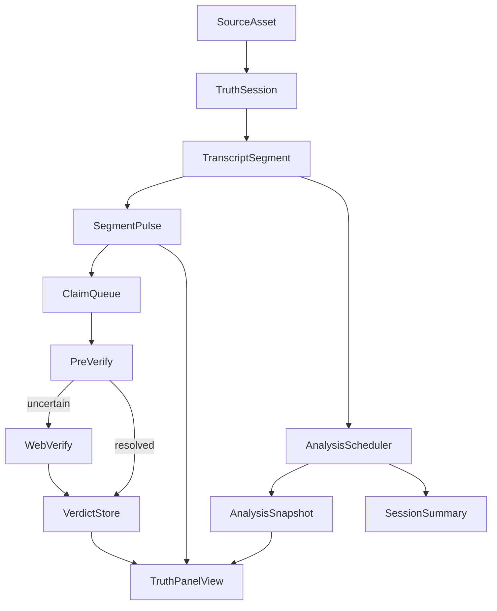

# Truth Terminal Architecture

## Why This Plan Exists

The current app already proves the product direction, but the important invariants are still implicit. The deepest risks are not visual polish or model choice; they are contract drift, duplicated analysis layers, and the lack of a single source of truth for session state.

The hot spots are visible in the code today:

```138:146:src/app/components/InsightsPanel.tsx
const analysis: AnalysisResult | null =
  patternsResult?.fullAnalysis ?? analysisResult;

const analysisLoading = isAnalysisLoading || (isPatternsLoading && !analysis);

const analysisSource: string | null = patternsResult?.fullAnalysis
  ? "Full transcript"
  : analysisResult
      ? "Partial · updating when full transcript ready"
      : null;
```

```62:68:src/lib/types.ts
export interface PatternsResult {
  patterns: PatternEntry[];
  trustTrajectory: number[];
  overallAssessment: string;
  /** Full-transcript rhetorical breakdown (merged into L3 since it has the complete context). */
  fullAnalysis?: AnalysisResult;
}
```

```74:92:src/lib/schemas.ts
fullAnalysis: z.object({
  tldr: z.string().describe("1-2 sentence summary of the core claim"),
  corePoints: z.array(z.string()).describe("Key arguments, stripped of rhetoric"),
  underlyingStatement: z.string().describe("What they actually want you to believe"),
  evidenceTable: z.array(
    z.object({
      claim: z.string(),
      evidence: z.string().describe("Supporting evidence or lack thereof"),
    })
  ),
  appeals: z.object({
    ethos: z.string().describe("How they establish credibility"),
    pathos: z.string().describe("Emotional language and framing"),
    logos: z.string().describe("The actual logical chain"),
  }),
  assumptions: z.array(z.string()).describe("Premises taken for granted but not proven"),
  steelman: z.string().describe("Strongest, most defensible version of the argument"),
  missing: z.array(z.string()).describe("Evidence or counterarguments that would strengthen or challenge the argument"),
}).describe("Full rhetorical analysis using the complete transcript"),
```

That mismatch captures the larger issue: the UI, schemas, prompts, and routes do not yet share one canonical model.

## Target Architecture

The rearchitecture should establish one source-of-truth session model that supports all three input paths without branching the product into separate implementations.



### Canonical domain model

Keep the core model flat and boring so it is easy to reason about across UI and backend.

- `TruthSession`: session id, `mode` (`streaming` or `batch`), `inputKind` (`voice`, `paste`, `url`), lifecycle timestamps, optional source metadata.
- `SourceAsset`: original source metadata such as URL, extracted title, excerpt, and any future clip/export provenance.
- `TranscriptSegment`: stable `segmentId`, text, ordinal index, optional `startMs` and `endMs`, and source linkage. This should become the shared unit for voice, paste, and URL.
- `SegmentPulse`: current L1 output for a segment (`claims`, `flags`, `tone`, `confidence`).
- `AnalysisSnapshot`: the unified L2+L3 result for a specific session window or full batch run, including rhetorical analysis, patterns, trust trajectory, and provenance about what window produced it.
- `SessionSummary`: rolling summary used only as analysis context, never as the user-facing source of truth.
- `ClaimCandidate`: normalized claim text tied to one or more segment ids, priority, dedupe key, and verification eligibility.
- `ClaimVerdict`: final verification state with `verdict`, `source`, `confidence`, explanation, and citations.
- `VerificationRun`: queue/run metadata, per-session caps, status, and counts so the UI can distinguish `queued`, `model-assessed`, `web-verified`, `skipped`, and `cap-exceeded`.
- `TruthPanelView`: derived view model only. Do not store this as source-of-truth state.

### State ownership defaults

Use these as default architectural constraints unless we intentionally revise them later:

- Keep source-of-truth session state client-side for the prototype.
- Do not add Zustand or Redux. Extract a reducer/hook from [src/app/page.tsx](src/app/page.tsx) instead.
- Do not add backend persistence yet. If refresh survival is needed, persist only a lightweight session envelope in `localStorage` after contracts are stable.
- Keep all model responses schema-validated JSON. Do not move the production pipeline toward scratchpad-style freeform markdown.

## What Changes First

### 1. Contract-first cleanup

Rework [src/lib/types.ts](src/lib/types.ts) and [src/lib/schemas.ts](src/lib/schemas.ts) so there is a shared `rhetoricalCoreSchema` reused by every analysis response. Remove the optional-vs-required drift around `fullAnalysis`, and define the verification/session types that the current plan only sketches.

Likely touch points:

- [src/lib/types.ts](src/lib/types.ts)
- [src/lib/schemas.ts](src/lib/schemas.ts)
- [src/lib/prompts.ts](src/lib/prompts.ts)
- [TRUTHLENS_ARCHITECTURE.md](TRUTHLENS_ARCHITECTURE.md)

### 2. Move orchestration out of `page.tsx`

Turn [src/app/page.tsx](src/app/page.tsx) into a composition shell instead of the entire runtime. Extract a single `useTruthSession`-style hook and one small policy module for scheduling. That hook should own:

- session initialization and resets
- segment append/flush behavior
- request ids and stale-response protection
- pipeline status per stage (`idle`, `running`, `success`, `error`)
- batch vs streaming policy differences
- selectors that feed the panel UI

Likely touch points:

- [src/app/page.tsx](src/app/page.tsx)
- [src/hooks/useVoiceInput.ts](src/hooks/useVoiceInput.ts)
- new `src/hooks/useTruthSession.ts`
- new `src/lib/pipeline-policy.ts`

### 3. Consolidate analysis into one backend contract

Replace the current split between [src/app/api/analyze/deep/route.ts](src/app/api/analyze/deep/route.ts) and [src/app/api/analyze/patterns/route.ts](src/app/api/analyze/patterns/route.ts) with one `POST /api/analyze` route that returns one `AnalysisSnapshot` contract.

Important rules:

- The route should be pure analysis, not search orchestration.
- It should accept `segments`, optional `runningSummary`, and a `mode` or `horizon` field so streaming and batch share the same shape.
- `trustTrajectory` should eventually be keyed to segment ids or explicit window semantics rather than a bare number array.

Likely touch points:

- [src/app/api/analyze/deep/route.ts](src/app/api/analyze/deep/route.ts)
- [src/app/api/analyze/patterns/route.ts](src/app/api/analyze/patterns/route.ts)
- new `src/app/api/analyze/route.ts`
- [src/lib/prompts.ts](src/lib/prompts.ts)
- [src/lib/structured-generate.ts](src/lib/structured-generate.ts)

### 4. Decouple verification into its own pipeline

The current L2 route mixes rhetorical analysis and Tavily lookup. Split that into a verification pipeline with clear claim and verdict models.

Likely sequence:

- extract `ClaimCandidate` generation from pulse output
- build queue and dedupe logic
- add `pre-check` route for cheap model-side triage
- add web verification route for uncertain claims only
- replace flat `sources[]` on `AnalysisResult` with verdict-centric UI data

Likely touch points:

- [src/app/api/analyze/deep/route.ts](src/app/api/analyze/deep/route.ts)
- [src/lib/tavily.ts](src/lib/tavily.ts)
- new `src/app/api/verify/pre-check/route.ts`
- new `src/app/api/verify/route.ts`
- new `src/lib/claim-queue.ts`
- future `src/lib/exa.ts`

### 5. Collapse the UI into one primary panel

Replace the Insights/Debug split with one `TruthPanel`-style composition root so glanceability and drill-down are just two layers of the same session state.

The new panel should have:

- a top glance layer: trust line, live flag feed, summary stats
- a detail layer: Analysis, Verdicts, Patterns
- the same data model in batch and streaming mode, but different default section emphasis

This is the right time to delete duplication rather than wrap it.

Likely touch points:

- [src/app/components/InsightsPanel.tsx](src/app/components/InsightsPanel.tsx)
- [src/app/components/AnalysisPanel.tsx](src/app/components/AnalysisPanel.tsx)
- [src/app/components/PatternsPanel.tsx](src/app/components/PatternsPanel.tsx)
- [src/app/components/PulseFeed.tsx](src/app/components/PulseFeed.tsx)
- [src/app/components/ConfidenceMeter.tsx](src/app/components/ConfidenceMeter.tsx)
- new `src/app/components/TruthPanel.tsx`

### 6. Preserve useful metadata through the pipeline

Do not drop extracted source metadata anymore. [src/app/api/extract/route.ts](src/app/api/extract/route.ts) already returns `title`, `text`, and `excerpt`; the session model should preserve these on `SourceAsset` so future persistence, share links, and clip workflows do not require another rewrite.

## Scope Guardrails

To keep this maintainable, explicitly defer these until the core contracts are working:

- full backend persistence or Convex adoption
- YouTube clip extraction
- Gemini/topic segmentation side-paths
- elaborate event sourcing or job infrastructure
- a forest of tiny service files before boundaries are proven

## Definition Of Done

This plan is successful when:

- [src/app/page.tsx](src/app/page.tsx) is no longer the hidden state machine for the whole product.
- One analysis schema and one prompt family power both batch and streaming analysis.
- Verification has its own contracts, statuses, and UI section.
- Every user-visible row or chart can be traced back to a stable `segmentId` or claim id.
- The UI has one primary composition root instead of duplicated Insights and Debug representations.
- The updated [TRUTHLENS_ARCHITECTURE.md](TRUTHLENS_ARCHITECTURE.md) describes the code as it actually exists.
