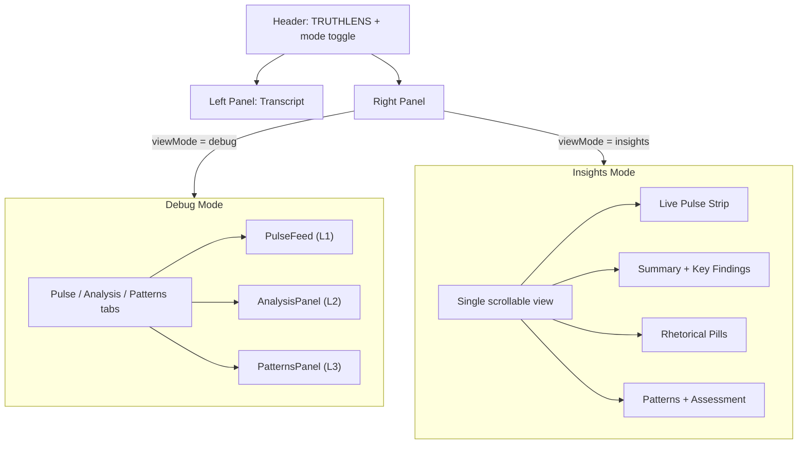

# TruthLens UX Overhaul

## Problems Identified (from screenshots and feedback)

1. **Left panel scroll is locked** -- voice transcript auto-appends but user cannot scroll back to review what was said
2. **Forced tab switch from L1 to L2** -- `triggerL2` calls `setActiveTab("analysis")` which yanks the user away mid-stream; same issue with the Pulse auto-scroll pinning to bottom
3. **Collapsible sections are buried** -- the `+`/`-` accordion in AnalysisPanel requires clicking to reveal each section; too many clicks to see insights
4. **Information density is overwhelming** -- wall of text with no visual hierarchy for casual users
5. **No separation between "showing off the backend" and "useful for the user"** -- current UI is great for demo/hackathon judges but not for actual consumption

## Solution: Dual-Mode UI with Smart Scroll

### 1. Smart Auto-Scroll (both panels)

**Files:** [PulseFeed.tsx](src/app/components/PulseFeed.tsx), [TranscriptInput.tsx](src/app/components/TranscriptInput.tsx)

Replace the hard `scrollTop = scrollHeight` with a "follow mode" that pauses when the user scrolls up and resumes when they scroll back to the bottom:

```typescript
const isNearBottom = container.scrollHeight - container.scrollTop - container.clientHeight < 80;
if (isNearBottom) {
  container.scrollTop = container.scrollHeight;
}
```

Add a small "scroll to live" pill that appears when the user has scrolled up and new content arrives, so they can jump back to the live feed.

Apply this to:

- `PulseFeed` (right panel, currently forces scroll on every entry)
- Voice transcript div in `TranscriptInput` (left panel)

### 2. Stop Forcing Tab Switches

**File:** [page.tsx](src/app/page.tsx)

Remove `setActiveTab("analysis")` from `triggerL2` (line 74). Instead, show a subtle notification on the Analysis tab indicating results are ready -- the pulsing yellow dot already exists, that's sufficient. Let the user switch when they want to.

### 3. View Mode Toggle: "Debug" vs "Insights"

**File:** [page.tsx](src/app/page.tsx)

Add a `viewMode` state: `"debug" | "insights"` with a toggle in the header.

- **Debug mode** = current UI exactly as-is (tabs, raw pulse entries, collapsible sections, all the backend processing visible). Rename header subtitle to show "DEBUG VIEW" or similar.
- **Insights mode** = new clean UI for the right panel. A single scrollable view instead of tabs.

The toggle can be a simple text button in the header next to the TRUTHLENS title (e.g., two small pills: `INSIGHTS` / `DEBUG`).

### 4. New Insights Panel (User Mode)

**New file:** `src/app/components/InsightsPanel.tsx`

A single, non-tabbed panel that synthesizes all three analysis levels into one scrollable view with clear visual hierarchy:

**Layout (top to bottom):**

- **Live Pulse Strip** -- horizontal scrolling row of small cards at the top, each showing a chunk's key flag (if any) as a colored dot/pill. Gives a bird's-eye view of the stream. Clicking a dot scrolls the left transcript to that chunk.
- **Summary Card** -- when L2 is ready, show the `tldr` and `underlyingStatement` in a prominent card. No clicking to reveal.
- **Key Findings** -- flat list of the most important items pulled from L2 analysis:
  - Core points as bullet items (always visible, no accordion)
  - Evidence gaps shown as orange/red pills inline (e.g., `MISSING SOURCE`, `SINGLE ANECDOTE`)
  - Assumptions shown as yellow pills
- **Rhetorical Breakdown** -- horizontal pill bar for ethos/pathos/logos (clickable to expand inline, not a separate accordion section)
- **Steelman** -- always visible in a green-bordered card
- **Patterns** -- when L3 is ready, show the trust trajectory chart and pattern cards inline (same as current PatternsPanel but embedded, not on a separate tab)
- **Overall Assessment** -- bottom card with the L3 overall assessment

The key difference from the current AnalysisPanel: everything is visible without clicking, uses cards and pills instead of accordions, and combines L1+L2+L3 into one stream.

### 5. Transcript-Analysis Linking

**Files:** [TranscriptInput.tsx](src/app/components/TranscriptInput.tsx), [InsightsPanel.tsx](src/app/components/InsightsPanel.tsx)

In insights mode, the left panel voice transcript chunks get subtle color-coded left borders matching their flags (green = no issues, orange = vague/partial, red = flagged). This gives at-a-glance visual feedback without requiring the user to read the right panel.

### 6. File Change Summary

| File                      | Change                                                                                                                   |
| ------------------------- | ------------------------------------------------------------------------------------------------------------------------ |
| `page.tsx`                | Add `viewMode` state, toggle in header, remove forced tab switch, conditionally render InsightsPanel vs tab-based panels |
| `PulseFeed.tsx`           | Smart auto-scroll with "scroll to live" pill                                                                             |
| `TranscriptInput.tsx`     | Smart auto-scroll for voice transcript, color-coded chunk borders in insights mode                                       |
| `InsightsPanel.tsx` (new) | Unified insights view combining L1+L2+L3                                                                                 |
| `AnalysisPanel.tsx`       | No changes (kept for debug mode)                                                                                         |
| `PatternsPanel.tsx`       | No changes (kept for debug mode)                                                                                         |


