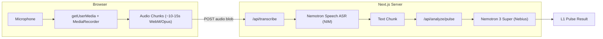
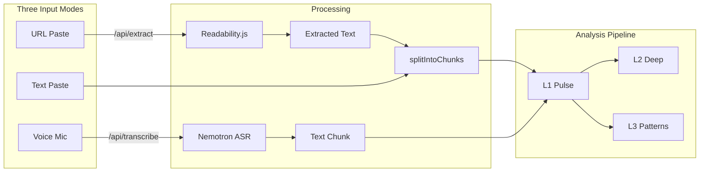

# Voice Chunking + URL Input for L1 Using Nemotron ASR

## Feasibility: Confirmed

NVIDIA ships a purpose-built model for exactly this: **Nemotron Speech ASR Streaming** (`nvidia/nemotron-speech-streaming-en-0.6b`). It is a 600M-parameter, cache-aware FastConformer-RNNT model designed for sub-100ms streaming latency. Combined with your existing Nemotron 3 Super for analysis, the entire stack becomes all-Nemotron -- a compelling story for the NVIDIA hackathon.

There is also **Nemotron 3 VoiceChat** (12B), a full-duplex speech-to-speech model, but it is in early access and designed for conversational agents, not claim analysis. The cascaded approach (ASR then LLM) is the right call here.

## Why This Fits Perfectly

The existing architecture chunks text into ~400-500 char segments and fires L1 on each one. Voice input naturally creates the same chunking -- each ~10-15 second audio segment becomes one text chunk. The voice chunking IS the text chunking. No architectural changes needed to L1/L2/L3.



## The All-Nemotron Pitch

- **Nemotron Speech ASR** (0.6B) -- voice to text, sub-100ms streaming latency
- **Nemotron 3 Super** (120B) -- text to structured analysis at ~400 tok/s
- One ecosystem, two models, three analysis tiers, real-time voice input

This is the kind of agentic pipeline the hackathon judges want to see: a user puts in earbuds, listens to a broadcast, and TruthLens flags claims in real-time without them touching their phone.

## Architecture Decision: ASR Integration Path

There are three options for calling the ASR model. The right choice depends on what infrastructure you have for the hackathon:

### Option A: NVIDIA NIM Cloud (Free API Key) -- Recommended

- Get a free API key from [build.nvidia.com](https://build.nvidia.com/nvidia/parakeet-ctc-1_1b-asr)
- Call the Parakeet ASR model via gRPC at `grpc.nvcf.nvidia.com:443`
- Requires `@grpc/grpc-js` npm package + Riva proto definitions
- **Pro**: Pure NVIDIA cloud, no GPU needed, free tier, hackathon-impressive
- **Con**: gRPC from Node.js requires proto compilation setup
- **New env var**: `NVIDIA_API_KEY`

### Option B: Self-Hosted NIM Container (If GPU Available)

- `docker run` the NIM ASR container locally
- Exposes a simple HTTP endpoint: `POST http://localhost:9000/v1/audio/transcriptions` (OpenAI Whisper-compatible!)
- Also exposes WebSocket at `ws://localhost:9000/v1/realtime?intent=transcription` for true streaming
- **Pro**: Simple REST/WebSocket API, very easy to integrate
- **Con**: Requires NVIDIA GPU with Docker

### Option C: Fallback -- Web Speech API in Browser

- Use browser's built-in `webkitSpeechRecognition` for transcription
- Zero server-side ASR, simplest to implement
- **Pro**: Works immediately, no API key needed
- **Con**: Not Nemotron (dilutes the story), inconsistent across browsers
- Could be used as a graceful fallback when ASR endpoint is unavailable

**Recommendation**: Start with Option A (NIM cloud gRPC). If the gRPC setup proves too complex under hackathon time pressure, fall back to Option C with the Web Speech API and still show Nemotron ASR as a separate capability.

## URL Input: Article Extraction

Alongside voice and text paste, users can paste a URL to analyze an article, blog post, or news piece. The server fetches the page, extracts the article body using Mozilla's Readability.js (the same library powering Firefox Reader View), and feeds the extracted text into the existing chunking pipeline.

### How It Works

1. User pastes a URL into the input field
2. Frontend detects the URL pattern and shows a "Fetch & Analyze" button
3. Calls `POST /api/extract` with the URL
4. Server fetches HTML, runs Readability.js to extract clean article text
5. Returns extracted text to the client
6. Text is fed into the existing `splitIntoChunks` -> L1/L2/L3 pipeline (same as paste)

### Dependencies

- `@mozilla/readability` -- article extraction (Firefox Reader View engine)
- `jsdom` -- DOM implementation for Node.js (required by Readability)

These are lightweight, well-maintained, and have no native dependencies -- safe for hackathon use.



## Implementation Plan

### Files to Create

- `src/hooks/useVoiceInput.ts` -- Custom hook for mic capture, chunking, and transcription
- `src/app/api/transcribe/route.ts` -- API route that proxies audio to NIM ASR
- `src/app/api/extract/route.ts` -- API route that fetches a URL and extracts article text
- `src/lib/nvidia-asr.ts` -- NIM ASR client (gRPC or HTTP depending on option)

### Files to Modify

- `[src/app/components/TranscriptInput.tsx](src/app/components/TranscriptInput.tsx)` -- Add mic toggle button and URL detection alongside existing textarea
- `[src/app/page.tsx](src/app/page.tsx)` -- Wire voice input mode and URL extraction to the existing chunk processing loop
- `[package.json](package.json)` -- Add `@grpc/grpc-js`, `@grpc/proto-loader` (if Option A), `@mozilla/readability`, `jsdom`

### Key Implementation Details

**Browser audio capture** (`useVoiceInput.ts`):

- `navigator.mediaDevices.getUserMedia({ audio: true })` for mic access
- `MediaRecorder` with `audio/webm;codecs=opus` (broadly supported)
- `timeslice` parameter set to ~10000ms (10s chunks) so `ondataavailable` fires every 10 seconds
- Each chunk is a self-contained audio blob sent to the server

**Transcription route** (`/api/transcribe`):

- Receives audio blob as `multipart/form-data`
- Forwards to NIM ASR (gRPC cloud or HTTP self-hosted)
- Returns `{ text: string }` -- the transcribed chunk

**Page integration** (`page.tsx`):

- New `handleVoiceChunk` callback that processes one chunk at a time (like a streaming version of `handleAnalyze`)
- Each transcribed chunk immediately triggers L1
- L2 triggers after 3-4 voice chunks accumulate
- L3 triggers after 6+ voice chunks
- The existing `splitIntoChunks` is bypassed -- voice segments ARE the chunks

**URL extraction route** (`/api/extract`):

- Receives `{ url: string }` as JSON
- Fetches HTML with standard `fetch()`, sets a reasonable User-Agent
- Parses with `jsdom`, extracts with `@mozilla/readability`
- Returns `{ title: string, text: string, excerpt: string }`
- The `text` field is the clean article body, ready for `splitIntoChunks`

```typescript
import { Readability } from "@mozilla/readability";
import { JSDOM } from "jsdom";

const html = await fetch(url).then((r) => r.text());
const doc = new JSDOM(html, { url });
const article = new Readability(doc.window.document).parse();
// article.textContent is the clean extracted text
```

**UI changes** (`TranscriptInput.tsx`):

- Detect URL input: if the textarea content matches a URL pattern, show "Fetch & Analyze" instead of "Analyze"
- Add a mic icon button that toggles recording state
- Three input modes reflected in UI: text paste (default), URL (auto-detected), voice (mic toggle)
- When recording: show a waveform/pulse indicator instead of the textarea
- Transcribed text accumulates in a read-only transcript view
- Recording state: idle / recording / processing

### NIM ASR gRPC Integration (Option A detail)

The Riva ASR gRPC proto files define a `RecognizeRequest` message. For offline (chunk-at-a-time) transcription from Node.js:

```typescript
import { credentials } from "@grpc/grpc-js";
import { loadSync } from "@grpc/proto-loader";

const packageDef = loadSync("riva_asr.proto");
const client = new RivaSpeechRecognitionClient(
  "grpc.nvcf.nvidia.com:443",
  credentials.createSsl(),
  {
    "grpc.metadata": { "function-id": ASR_FUNCTION_ID, authorization: `Bearer ${NVIDIA_API_KEY}` },
  },
);
```

The Riva proto files can be downloaded from [NVIDIA's github](https://github.com/nvidia-riva/common/tree/main/riva/proto).
